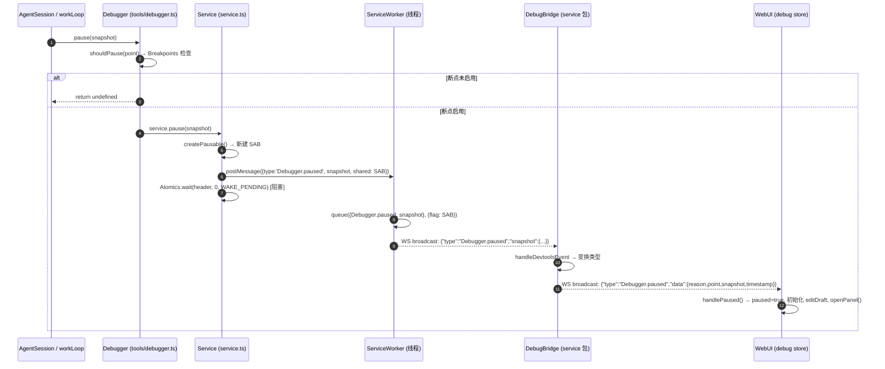
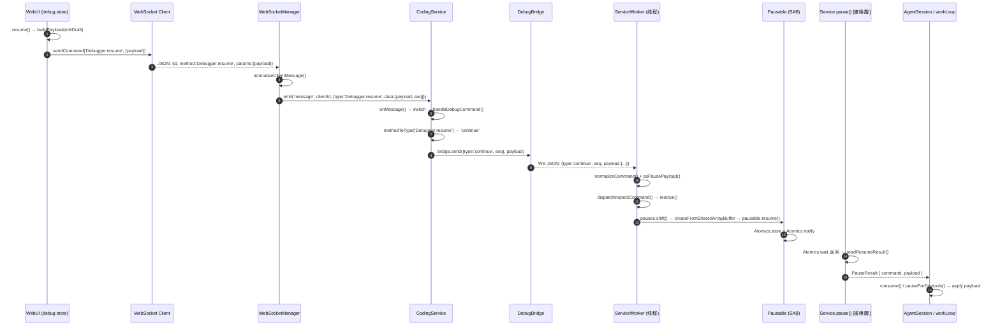
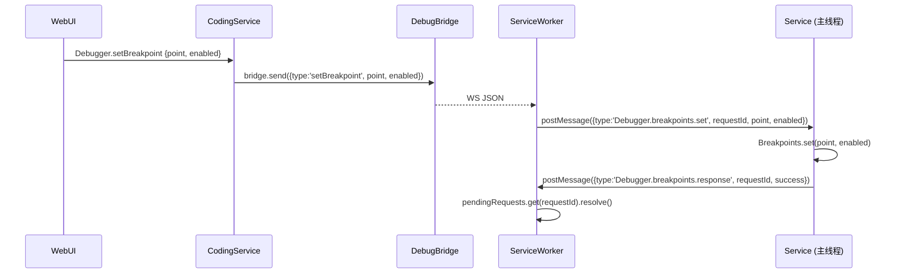

# Coding ↔ Devtools ↔ WebUI 指令时序技术文档

> **范围**: `@vitamin/coding`, `@vitamin/agent`, `@vitamin/devtools`, `@vitamin/service`, `@vitamin/web-ui`
>
> **目标**: 完整描述调试指令在所有包之间的双向流转路径、协议格式、数据变换与副作用
>
> **日期**: 2026-04-06（基于实际代码审计重写）

---

## 目录

1. [架构总览](#1-架构总览)
2. [协议清单](#2-协议清单)
3. [SharedArrayBuffer 协议](#3-sharedarraybuffer-协议)
4. [断点清单](#4-断点清单)
5. [Direction A: Coding → Devtools → WebUI（暂停事件流）](#5-direction-a-coding--devtools--webui暂停事件流)
6. [Direction B: WebUI → Devtools → Coding（命令 + Payload 流）](#6-direction-b-webui--devtools--coding命令--payload-流)
7. [Payload 应用机制](#7-payload-应用机制)
8. [断点管理旁路](#8-断点管理旁路)
9. [当前 Gap 与演进方向](#9-当前-gap-与演进方向)

---

## 1. 架构总览

### 1.1 参与包与核心模块

| 包 | 核心模块 | 职责 |
|---|---|---|
| `@vitamin/coding` | `session/agent-session.ts` | Session 生命周期断点触发、`consume()` 应用 payload 到 session 上下文 |
| `@vitamin/agent` | `work-loop.ts`, `tool-executor.ts` | Agent 循环断点触发、`pauseForDevtools()` / `apply()` 应用 payload 到 loop 变量 |
| `@vitamin/devtools` | `tools/debugger.ts`, `service.ts`, `service-worker.ts`, `pausable.ts`, `protocol.ts` | 断点门控、SAB 创建与阻塞等待、Worker 线程 WS 广播与命令消费 |
| `@vitamin/service` | `coding-service.ts`, `debug-bridge.ts`, `websocket-manager.ts` | 命令路由、协议适配、WS 桥接 |
| `@vitamin/web-ui` | `stores/debug.ts`, `api/devtools-dispatcher.ts`, `api/devtools.ts`, `api/websocket.ts` | 调试面板状态管理、命令发送、事件消费 |

### 1.2 线程与进程边界

```
┌──────────────────────────────────────────────────────────────────────┐
│ Node.js 主进程                                                        │
│                                                                      │
│  ┌─────────────┐    ┌──────────────────┐    ┌────────────────────┐   │
│  │ AgentSession │───▶│ Devtools.Debugger│───▶│ Devtools.Service   │   │
│  │ (coding)     │    │ (断点门控)        │    │ (SAB + postMessage)│   │
│  └─────────────┘    └──────────────────┘    └────────┬───────────┘   │
│         │                                            │ postMessage   │
│  ┌─────────────┐                                     │               │
│  │  workLoop   │  Atomics.wait 阻塞                   ▼               │
│  │  (agent)    │◀─────────────────────  ┌──────────────────────┐     │
│  └─────────────┘                        │ ServiceWorker (线程) │     │
│                                         │ WS Server on :port   │     │
│                                         └──────────┬───────────┘     │
└────────────────────────────────────────────────────│─────────────────┘
                                                     │ WebSocket
                                            ┌────────▼────────┐
                                            │ Service          │
                                            │ (DebugBridge)    │
                                            │ (CodingService)  │
                                            │ (WebSocketMgr)   │
                                            └────────┬─────────┘
                                                     │ WebSocket
                                            ┌────────▼────────┐
                                            │ WebUI (Browser)  │
                                            │ debug store      │
                                            │ devtools panel    │
                                            └─────────────────┘
```

关键边界:
- **主线程 ↔ Worker 线程**: `postMessage` + `SharedArrayBuffer` (Atomics)
- **Worker ↔ Service**: WebSocket (`ws://host:port/{serviceId}/inspect`)
- **Service ↔ WebUI**: WebSocket (`ws://host:servicePort/`)

---

## 2. 协议清单

### 2.1 主线程 → Worker (postMessage)

| `type` | 附加字段 | 说明 |
|---|---|---|
| `Debugger.paused` | `snapshot: DebugSnapshot`, `shared: SharedArrayBuffer` | 暂停事件，携带 SAB 用于命令回写 |
| `Log.entryAdded` | `message: string` (JSON) | 日志条目广播 |
| `Session.update` | `message: string` (JSON) | 会话状态广播 |
| `Runtime.stop` | — | 停止 Worker |
| `broadcast` | `message: string` | 通用广播 |
| `Debugger.breakpoints.response` | `requestId`, `success`, `payload?` | 断点请求应答 |

### 2.2 Worker → 主线程 (postMessage)

| `type` | 附加字段 | 说明 |
|---|---|---|
| `Debugger.started` | `port: number` | Worker WS 服务启动完成 |
| `Debugger.stopped` | — | Worker 已停止 |
| `Debugger.enabled` | — | 调试器启用 |
| `Debugger.disabled` | — | 调试器禁用 |
| `Debugger.breakpoints.list` | `requestId` | 请求断点列表 |
| `Debugger.breakpoints.set` | `requestId`, `point`, `enabled` | 设置单个断点 |
| `Debugger.breakpoints.setAll` | `requestId`, `enabled` | 全局启停 |

### 2.3 Worker ↔ WS Inspector 客户端

**Worker → 客户端 (broadcast):**

| JSON `type` | 数据 | 说明 |
|---|---|---|
| `Debugger.paused` | `{ snapshot }` | 暂停事件广播 |
| `Debugger.command` | `{ command }` | 无匹配 pause 时的命令透传 |
| `Log.entryAdded` | 透传 | 日志 |
| `Session.update` | 透传 | 会话状态 |

**客户端 → Worker:**

自由 JSON，经 `normalizeCommand()` 解析为:
```ts
{ type: 'continue'|'next'|'step'|'over'|'stop', seq: number, depth?: number, payload?: PauseResumePayload }
```

### 2.4 Service ↔ DebugBridge

`DebugBridge` 连接 `ws://127.0.0.1:{port}/{serviceId}/inspect`。

**Bridge → Worker**: `{ type, seq, depth?, payload? }` — 与 Inspector 客户端格式相同

**Worker → Bridge**: 同 §2.3 广播格式

**Bridge 事件变换** (`handleDevtoolsEvent`):

| 收到 | 转发到 WebUI | 变换 |
|---|---|---|
| `Debugger.paused` | `Debugger.paused` | 添加 `reason: 'breakpoint'`、`point`、`timestamp` |
| `Debugger.command` | `Debugger.resumed` | 包装 `command` + `timestamp` |
| 日志帧 | `Log.entryAdded` | 格式化为 `LogEntry` |

### 2.5 WebUI ↔ Service (WebSocket)

**WebUI → Service (CDP-style CommandFrame):**

```json
{ "id": 42, "method": "Debugger.resume", "params": { "payload": {...} } }
```

调试命令方法: `Debugger.resume`, `Debugger.stepOver`, `Debugger.stepInto`, `Debugger.disable`, `Debugger.setBreakpoint`, `Debugger.setBreakpointsActive`

**Service → WebUI (EventFrame):**

```json
{ "type": "Debugger.paused", "data": { "reason": "breakpoint", "snapshot": {...}, ... } }
```

调试事件类型: `Debugger.paused`, `Debugger.resumed`, `Debugger.breakpointsChanged`, `Log.entryAdded`

---

## 3. SharedArrayBuffer 协议

### 3.1 内存布局

源文件: `packages/devtools/src/pausable.ts` + `packages/devtools/src/protocol.ts`

```
┌──────────────────────────────────────────────────────────────┐
│ SharedArrayBuffer (SAB_HEADER_SIZE + SAB_DEFAULT_PAYLOAD_SIZE) │
│                                                              │
│  ┌──────────────┐  Header: Int32Array[3], 12 bytes           │
│  │ [0] STATE    │  WAKE_PENDING=0 | WAKE_RESUMED=1           │
│  │              │  | WAKE_WITH_PAYLOAD=2                      │
│  │ [1] COMMAND  │  CONTINUE=0 | NEXT=1 | STEP=2              │
│  │              │  | OVER=3 | STOP=4                          │
│  │ [2] PAY_LEN  │  payload 字节长度                           │
│  └──────────────┘                                            │
│  ┌──────────────┐  Region: Uint8Array, 65536 bytes (默认)     │
│  │ JSON payload │  TextEncoder 编码的 PauseResumePayload      │
│  │ ...          │                                            │
│  └──────────────┘                                            │
└──────────────────────────────────────────────────────────────┘
```

常量定义:
- `SAB_HEADER_SIZE = 12`
- `SAB_DEFAULT_PAYLOAD_SIZE = 64 * 1024`

### 3.2 状态机

```
                    Coding 侧 (主线程)                    Worker 侧
                    ─────────────────                    ─────────

    创建 SAB, STATE=WAKE_PENDING(0)
              │
    Atomics.wait(header, 0, 0)
    ┌─────────┤ [线程阻塞]
    │         │
    │         │                          收到 WS 命令
    │         │                               │
    │         │                    Atomics.store(COMMAND, type)
    │         │                    if payload:
    │         │                      region.set(encoded)
    │         │                      store(PAY_LEN, len)
    │         │                      store(STATE, WAKE_WITH_PAYLOAD=2)
    │         │                    else:
    │         │                      store(PAY_LEN, 0)
    │         │                      store(STATE, WAKE_RESUMED=1)
    │         │                    Atomics.notify(header, 0, 1)
    │         │                               │
    └────────▶│ [线程唤醒]                     │
              │                               │
    readResumeResult()
      → { state, command, payload }
              │
    返回 PauseResult { command, payload }
```

### 3.3 Pausable API

```ts
class Pausable {
  static create(size?: number): Pausable           // 创建新 SAB
  static from(shared: SharedArrayBuffer): Pausable  // 从已有 SAB 包装

  get buffer(): SharedArrayBuffer
  wait(expectedState?: number): void                // Atomics.wait 阻塞
  readResumeResult(): PauseResumeResult             // 读取 header + 解码 payload
  resume(command: DebugCommand | number, payload?: PauseResumePayload): void
  // 写入 SAB header + payload region + Atomics.notify 唤醒
}
```

---

## 4. 断点清单

源文件: `packages/devtools/src/protocol.ts` — `BREAKPOINT_POINTS`

### 4.1 Session 生命周期断点 (`agent-session.ts`, frameDepth=0)

| 断点 | 触发时机 | payload 消费方式 |
|---|---|---|
| `prompt_before` | prompt 方法入口，promptRefresh 之后 | `consume(result)` — 写回 systemPrompt / llmParams |
| `context_build` | Session 上下文构建完成后 | `consume(result, messages)` — 含 inject/remove messages |
| `messages_persist` | workLoop 完成，新消息持久化后 | `consume(result)` — 仅 systemPrompt / llmParams |
| `prompt_after` | after hook 完成后 | `consume(result)` — 仅 systemPrompt / llmParams |

### 4.2 Agent 循环断点 (`work-loop.ts`)

| 断点 | frameDepth | 触发时机 | payload 消费方式 |
|---|---|---|---|
| `loop_start` | 0 | workLoop 入口 | `pauseForDevtools()` → `apply()` |
| `context_transform` | 0 | transformContext 完成后 | `pauseForDevtools()` → `apply()` |
| `model_before` | 0 | LLM 调用前（**直接调用，非 invariant 内**） | `pauseForDevtools()` → `apply()`, 返回 payload 触发 message 重建 |
| `model_after` | 0 | LLM 流完成后 | `pauseForDevtools()` → `apply()` |
| `tool_before` | 1 | 单个工具执行前 | `pauseForDevtools()` → `apply()` |
| `tool_after` | 1 | 单个工具执行后 | `pauseForDevtools()` → `apply()` |
| `steering_check` | 1 | steering 消息检查 | `pauseForDevtools()` → `apply()` |
| `loop_end` | 0 | 内循环退出后 | `pauseForDevtools()` → `apply()` |
| `follow_up_check` | 0 | follow-up 消息检查 | `pauseForDevtools()` → `apply()` |
| `agent_done` | 0 | 循环正常完成 | `pauseForDevtools()` → `apply()` |
| `agent_aborted` | 0 | AbortError 捕获 | `pauseForDevtools()` → `apply()` |
| `agent_error` | 0 | 其他错误捕获 | `pauseForDevtools()` → `apply()` |
| `loop_cleanup` | 0 | finally 块清理 | `pauseForDevtools()` → `apply()` |

> **`model_before` 特例**: 直接在 `workLoop` 函数体调用 `pauseForDevtools()` 而非在 `invariant()` 闭包内，因为需要使用返回的 payload 来判断是否需要重新执行 `transformContext` 构建 `contextMessages`。若在 `invariant` 闭包内执行，TypeScript 会将局部变量窄化为 `never` 类型。

### 4.3 工具执行器断点 (`tool-executor.ts`, frameDepth=2)

| 断点 | 触发时机 | payload 消费方式 |
|---|---|---|
| `tool_resolve` | 工具名称查找 | **不消费** — payload 被丢弃 |
| `tool_hook_before` | before hooks 执行前 | **不消费** — payload 被丢弃 |
| `tool_validate` | 参数验证完成 | **不消费** — payload 被丢弃 |
| `tool_hook_after` | after hooks 执行后 | **不消费** — payload 被丢弃 |

### 4.4 预留断点 (protocol.ts 中定义但当前无触发点)

| 断点 | 预期用途 |
|---|---|
| `session_create` | Session 创建时 |
| `session_fork` | Session 分支时 |
| `session_restore` | Session 恢复时 |

---

## 5. Direction A: Coding → Devtools → WebUI（暂停事件流）

### 5.1 完整调用链



### 5.2 阶段详解

**阶段 1: 断点触发**

调用入口分两层:

1. **Session 层** (`agent-session.ts`):
   ```ts
   invariant(() => {
     const result = this.devtools?.debugger.pause({...})
     consume(result)  // 或 consume(result, messages)
     return true
   }, 'description')
   ```

2. **Loop 层** (`work-loop.ts`):
   - **标准路径**: `invariant(() => { pauseForDevtools({...}); return true })`
   - **model_before 特例**: `const modelBeforePayload = pauseForDevtools({...})` — 直接调用，需使用返回值

**阶段 2: 断点门控**

`Debugger.pause()` (`tools/debugger.ts`):
```ts
pause(message: DebugSnapshot): PauseResult | undefined {
  if (this.shouldPause(message.point)) {
    return this.service.pause(message)
  }
  return undefined  // 断点禁用 → 不暂停
}
```
`shouldPause()` 委托给 `Breakpoints.shouldPause(point)` — 默认全部 `enabled: true`。

**阶段 3: SAB 创建与阻塞**

`Service.pause()` (`service.ts`):
```ts
pause(snapshot: DebugSnapshot): PauseResult {
  const pausable = createPausable()               // 新 SAB
  this.worker?.postMessage({
    type: 'Debugger.paused',
    snapshot,
    shared: pausable.buffer,                      // SAB 通过 postMessage 共享到 worker
  })
  pausable.wait(WAKE_PENDING)                     // Atomics.wait 阻塞调用线程
  const { state, command, payload } = pausable.readResumeResult()
  // state 校验...
  return { command, payload }
}
```

**关键**: `pause()` 是同步阻塞调用。Agent 执行线程在 `Atomics.wait` 处冻结，直到 Worker 写回 SAB 并调用 `Atomics.notify`。

**阶段 4: Worker 广播与排队**

`ServiceWorker.handlePausedMessage()` (`service-worker.ts`):
```ts
private handlePausedMessage(message: Record<string, unknown>): void {
  this.queue(
    { type: 'Debugger.paused', snapshot: message.snapshot },
    { flag: message.shared as SharedArrayBuffer },
  )
}
```

`queue()` 做两件事:
1. `broadcast(JSON.stringify(event))` — 向所有 WS 客户端发送暂停事件
2. `this.pauses.push(pause)` — 将 `{ flag: SAB }` 推入 FIFO 队列

WS 连接端点: `ws://host:port/{serviceId}/inspect`

**阶段 5: Bridge 变换与转发**

`DebugBridge.handleDevtoolsEvent()` (`debug-bridge.ts`):
```ts
case 'Debugger.paused':
  this.ws.broadcast({
    type: 'Debugger.paused',
    data: {
      reason: 'breakpoint',
      point: snapshot.point,
      snapshot,
      timestamp: new Date().toISOString(),
    },
  })
```

消息类型变换: `Debugger.paused` → `Debugger.paused`

**阶段 6: WebUI 消费**

`setupDevtoolsHandle()` (`devtools-dispatcher.ts`) 注册:
```ts
ws.on('Debugger.paused', (msg) => {
  const data = msg.data as { reason: string; snapshot: DebugSnapshot }
  useDevtoolsStore.getState().handlePaused(data)
  useDevtoolsStore.getState().openPanel()
})
```

`handlePaused()` (`stores/debug.ts`):
- 设置 `paused: true`, `pauseReason`, `currentSnapshot`
- 追加到 `snapshotHistory`（保留最近 50 条）
- 初始化 `editDraft`（预填 `systemPrompt` 和 `llmParams`）
- 自动打开 Debug 面板

---

## 6. Direction B: WebUI → Devtools → Coding（命令 + Payload 流）

### 6.1 完整调用链



### 6.2 阶段详解

**阶段 1: WebUI 命令组装**

`useDevtoolsStore` (`stores/debug.ts`):
```ts
resume: (payload) => {
  const draft = payload ?? buildPayload(get())
  sendDebuggerCommand('Debugger.resume', draft)
}
```

`buildPayload()` 比较 `editDraft` 与 `currentSnapshot`，仅在存在差异时返回 payload:
```ts
function buildPayload(state: DevtoolsState): PauseResumePayload | undefined {
  const { editDraft, currentSnapshot } = state
  const hasChanges =
    editDraft.systemPrompt !== currentSnapshot?.systemPrompt ||
    (editDraft.injectMessages?.length ?? 0) > 0 ||
    (editDraft.removeMessageIndices?.length ?? 0) > 0 ||
    JSON.stringify(editDraft.llmParams) !== JSON.stringify(currentSnapshot?.llmParams)
  return hasChanges ? editDraft : undefined
}
```

可用命令:

| Store 方法 | WS method | 语义 |
|---|---|---|
| `resume()` | `Debugger.resume` | 继续执行 |
| `stepOver()` | `Debugger.stepOver` | 单步越过 |
| `stepInto()` | `Debugger.stepInto` | 单步进入 |
| `disable()` | `Debugger.disable` | 终止调试执行 |

**阶段 2: WebSocket 发送**

`sendDebuggerCommand()` → `ws.sendCommand(method, { payload })`:
```ts
sendCommand(method: string, params: Record<string, unknown> = {}, id?: number) {
  this.send({ id: id ?? this.nextId++, method, params })
}
```

最终 JSON: `{ "id": 42, "method": "Debugger.resume", "params": { "payload": {...} } }`

**阶段 3: Service 协议适配**

`WebSocketManager.normalizeClientMessage()`: 提取 `method` → `type`, `params` → `data`, 注入 `seq`/`requestId`

`CodingService.handleDebugCommand()` (`coding-service.ts`):
```ts
private handleDebugCommand(method: string, data: Record<string, unknown>): void {
  const methodToType: Record<string, string> = {
    'Debugger.resume': 'continue',
    'Debugger.stepOver': 'next',
    'Debugger.stepInto': 'step',
    'Debugger.disable': 'stop',
  }
  const type = methodToType[method]
  this.bridge.send({ type, seq, ...depth }, data.payload)
}
```

**完整命令类型映射**:

| WebUI method | Bridge/Worker type | SAB COMMAND 常量 |
|---|---|---|
| `Debugger.resume` | `continue` | `COMMAND_CONTINUE (0)` |
| `Debugger.stepOver` | `next` | `COMMAND_NEXT (1)` |
| `Debugger.stepInto` | `step` | `COMMAND_STEP (2)` |
| — | `over` | `COMMAND_OVER (3)` |
| `Debugger.disable` | `stop` | `COMMAND_STOP (4)` |

**阶段 4: Bridge 转发**

`DebugBridge.send()` (`debug-bridge.ts`):
```ts
send(command: SendCommand, payload?: PauseResumePayload): void {
  if (this.socket?.readyState === WebSocket.OPEN) {
    this.socket.send(JSON.stringify({ ...command, payload }))
  }
}
```

连接断开时命令被静默丢弃（仅 warn 日志）。Bridge 自动重连间隔: 20s。

**阶段 5: Worker 命令处理**

`ServiceWorker` (`service-worker.ts`):

1. `handleInspectClientMessage(data: Buffer)` → `parseInspectCommandMessage(data)`
2. `normalizeCommand(parsed)` — 验证 `type` 合法性，提取 `seq`/`depth`/`reason`
3. `asPausePayload(parsed.payload)` — 类型守卫（对象且非数组）
4. `dispatchInspectCommand({command, payload})` — 按 `command.type` switch 分发到 5 个 handler
5. 所有 handler 最终调用 `this.resolve(command, payload)`

**阶段 6: SAB 回写与唤醒**

`ServiceWorker.resolve()`:
```ts
private resolve(command: DebugCommand, payload?: PauseResumePayload): void {
  const pause = this.pauses.shift()           // FIFO 出队
  if (!pause) {
    // 无匹配的暂停槽位 — 广播命令事件
    this.broadcast(JSON.stringify({ type: 'Debugger.command', command }))
    return
  }
  const pausable = createFromSharedArrayBuffer(pause.flag)
  pausable.resume(command, payload)           // 写入 SAB + Atomics.notify
}
```

`Pausable.resume()`:
1. `Atomics.store(header, COMMAND_INDEX, commandType)` — 写入命令类型
2. 如果有 payload:
   - `region.set(encoded)` — 写入 JSON 编码的 payload
   - `store(PAY_LEN, encoded.length)`
   - `store(STATE, WAKE_WITH_PAYLOAD=2)`
3. 否则:
   - `store(PAY_LEN, 0)`
   - `store(STATE, WAKE_RESUMED=1)`
4. `Atomics.notify(header, STATE_INDEX, 1)` — 唤醒一个等待线程

**阶段 7: Coding 恢复与 Payload 应用**

`Service.pause()` 中 `Atomics.wait` 被唤醒:
1. `readResumeResult()` 读取 header → 解析 commandType → 构造 `DebugCommand`
2. 如果 `state === WAKE_WITH_PAYLOAD`，读取 payload region → JSON.parse
3. 返回 `PauseResult { command, payload }`

→ 进入 [§7 Payload 应用机制](#7-payload-应用机制)

---

## 7. Payload 应用机制

### 7.1 PauseResumePayload 类型

```ts
interface PauseResumePayload {
  systemPrompt?: string                    // 替换系统提示词
  injectMessages?: InjectedMessage[]       // 注入新消息到 messages 末尾
  removeMessageIndices?: number[]          // 按索引移除消息（倒序执行）
  llmParams?: {
    temperature?: number
    maxTokens?: number
    thinkingLevel?: string
  }
  metadata?: Record<string, string | number | boolean | null>
}

interface InjectedMessage {
  role: 'user' | 'system'
  content: string
}
```

### 7.2 Session 层应用 (`agent-session.ts`)

`consume()` — 在 `prompt()` 方法作用域内定义的闭包:

```ts
const consume = (result: PauseResult | undefined, messages?: AgentMessage[]): void => {
  if (!result?.payload) return
  const payload = result.payload

  // 1. systemPrompt → 写回 this.systemPrompt (AgentSession 实例属性)
  if (payload.systemPrompt !== undefined) this.systemPrompt = payload.systemPrompt

  // 2. llmParams → 写入 overrides 局部变量
  if (payload.llmParams?.temperature !== undefined) overrides.temperature = ...
  if (payload.llmParams?.maxTokens !== undefined) overrides.maxTokens = ...
  if (payload.llmParams?.thinkingLevel) { overrides.thinkingLevel = ...; this.thinkingLevel = ... }

  // 3. 仅当传入 messages 参数时处理消息修改
  if (!messages) return
  if (payload.removeMessageIndices?.length) {
    // 倒序 splice — 避免索引偏移
    const sorted = [...payload.removeMessageIndices].sort((a, b) => b - a)
    for (const idx of sorted) messages.splice(idx, 1)
  }
  if (payload.injectMessages?.length) {
    for (const msg of payload.injectMessages) messages.push({...})
  }
}
```

`overrides` 流向: `overrides` → `paramsOutput` → `hookRegistry.execute('chat.params')` → `agent.run({ temperature, maxTokens, thinkingLevel })`

**Session 层各断点消费矩阵**:

| 断点 | systemPrompt | llmParams | inject/remove messages |
|---|---|---|---|
| `prompt_before` | ✅ | ✅ | ❌ (不传 messages) |
| `context_build` | ✅ | ✅ | ✅ |
| `messages_persist` | ✅ | ✅ | ❌ (不传 messages) |
| `prompt_after` | ✅ | ✅ | ❌ (不传 messages) |

### 7.3 Loop 层应用 (`work-loop.ts`)

**`pauseForDevtools()` 闭包** — 在 `workLoop()` 函数作用域内定义:

```ts
const pauseForDevtools = (snapshot: DebugSnapshot): PauseResumePayload | null => {
  const result = devtools?.debugger.pause(snapshot)
  if (result?.payload) {
    apply(result.payload, {
      getSystemPrompt: () => systemPrompt,
      setSystemPrompt: (v) => { systemPrompt = v },
      getTemperature: () => temperature,
      setTemperature: (v) => { temperature = v },
      getMaxTokens: () => maxTokens,
      setMaxTokens: (v) => { maxTokens = v },
      getThinkingLevel: () => thinkingLevel,
      setThinkingLevel: (v) => { thinkingLevel = v },
      messages,
    })
  }
  if (result?.command.type === 'stop') throw new AbortError('Stopped by debugger')
  return result?.payload ?? null
}
```

**`apply()` 纯函数** — `work-loop.ts` 文件底部:

```ts
function apply(payload: PauseResumePayload, target: PayloadApplyTarget): void {
  // 应用顺序:
  // 1. systemPrompt → target.setSystemPrompt
  // 2. removeMessageIndices → 倒序 splice target.messages
  // 3. injectMessages → push to target.messages
  // 4. llmParams.temperature → target.setTemperature
  // 5. llmParams.maxTokens → target.setMaxTokens
  // 6. llmParams.thinkingLevel → target.setThinkingLevel
}
```

**Loop 层所有断点统一消费**: 全 payload 字段 (systemPrompt + messages + llmParams)

**`model_before` 特殊后处理**:
```ts
const modelBeforePayload = pauseForDevtools({ point: 'model_before', ... })

// 如果 payload 修改了消息列表，须重新构建 contextMessages
if (modelBeforePayload?.injectMessages?.length || modelBeforePayload?.removeMessageIndices?.length) {
  if (transformContext) {
    contextMessages = await transformContext([...messages], signal)
  } else {
    contextMessages = [...messages]
  }
}
```

### 7.4 工具执行器不消费 Payload

`tool-executor.ts` 的 4 个断点 (`tool_resolve`, `tool_hook_before`, `tool_validate`, `tool_hook_after`) 直接调用 `this.devtools?.debugger.pause({...})` 但**不读取返回值**。在这些断点暂停后发送的 payload 会被丢弃。

### 7.5 `stop` 命令处理

- **work-loop 层**: `pauseForDevtools()` 检测到 `command.type === 'stop'` 时抛出 `AbortError('Stopped by debugger')`
- **session 层**: `consume()` 不检查 command type — stop 语义由 workLoop 的 `AbortError` 向上冒泡到 `prompt()` 的 catch 块

### 7.6 两层应用的关系

```
prompt() 入口
  │
  ├─ prompt_before ─── consume() → 写 this.systemPrompt / overrides
  ├─ context_build ─── consume(result, messages) → 含消息修改
  │
  ├─ agent.run() ───── 参数来源: overrides → paramsOutput
  │   │
  │   └─ workLoop() 入口
  │       │
  │       ├─ loop_start ──── pauseForDevtools() → apply() → 写局部变量
  │       ├─ model_before ── pauseForDevtools() → apply() → 可触发 contextMessages 重建
  │       ├─ model_after ─── pauseForDevtools() → apply()
  │       ├─ tool_* ──────── pauseForDevtools() → apply()
  │       ├─ ... (其余断点同理)
  │       └─ agent_done ──── pauseForDevtools() → apply()
  │
  ├─ messages_persist ─ consume() → 写 this.systemPrompt / overrides
  └─ prompt_after ───── consume() → 写 this.systemPrompt / overrides
```

---

## 8. 断点管理旁路

独立于暂停/恢复的主流程，断点管理使用 request-response 模式:

### 8.1 设置断点流程



Worker 使用 `requestId` + `Map<string, {resolve, reject}>` 实现跨线程异步 request-response。

### 8.2 可用操作

| 操作 | WebUI method | Worker → 主线程 type |
|---|---|---|
| 设置单个断点 | `Debugger.setBreakpoint` | `Debugger.breakpoints.set` |
| 全局启停 | `Debugger.setBreakpointsActive` | `Debugger.breakpoints.setAll` |
| 查询断点列表 | (HTTP API) | `Debugger.breakpoints.list` |

---

## 9. 当前 Gap 与演进方向

### 9.1 当前实现 Gap

| 维度 | 现状 | 影响 |
|---|---|---|
| **无 pauseId** | 每次 `Service.pause()` 创建新 SAB，Worker 仅通过 FIFO 队列匹配命令 | 并发场景下可能将命令送达错误的暂停槽位 |
| **无命令回执** | UI 发送命令后仅依赖 `Debugger.resumed` 被动判断 | 无法区分 "命令在排队"、"无匹配 pause"、"Bridge 断开" |
| **Service 层命令映射** | `CodingService` 做 `Debugger.resume → continue` 字符串映射 | 命令语义定义分散在 Service 层而非 Devtools 层 |
| **tool-executor payload 丢弃** | 4 个 frameDepth=2 断点不消费 `PauseResult` | 在这些断点处用户编辑的 payload 无任何效果 |
| **跨层标识不贯穿** | `seq` 仅在单边界内有意义，不跨包传播 | 全链路追踪和排障困难 |
| **无协议版本标识** | 消息帧无版本号字段 | 协议演进缺乏兼容性保障 |
| **Worker 无 pause 命中确认** | `resolve()` 无 pause 时广播 `Debugger.command` 但不标记为错误 | Bridge 将其转换为 `Debugger.resumed`，UI 无法区分成功和空转 |
| **Bridge 断开静默丢弃** | `send()` 在 socket 非 OPEN 时仅 warn 日志 | 命令丢失无反馈 |

### 9.2 演进建议

**Phase 1 — 可观测性补齐**:
1. 引入 `pauseId` (在 `Service.pause()` 中生成)，贯穿暂停的完整生命周期
2. Worker `resolve()` 无匹配时发送 `Debugger.commandRejected` 而非 `Debugger.command`
3. WebUI Debug Store 增加 `pendingCommand` / `lastRejectedReason` 状态
4. Bridge 连接断开时向 UI 发送 `Debugger.commandRejected { code: 'BRIDGE_DISCONNECTED' }`

**Phase 2 — 语义内聚**:
1. 命令类型映射 (`Debugger.resume → continue`) 迁移到 Devtools Worker 内部
2. Service 层仅做路由转发和权限校验，不承担语义翻译
3. 消息帧增加可选 `protocolVersion` 字段

**Phase 3 — 能力补全**:
1. `tool-executor.ts` 断点消费 `PauseResult`，支持工具级上下文修改
2. 条件断点表达式支持 (`shouldPause` 基于 snapshot metadata 评估)
3. 多 Session 并行调试隔离 (`pauseId` 关联 `sessionId`)
