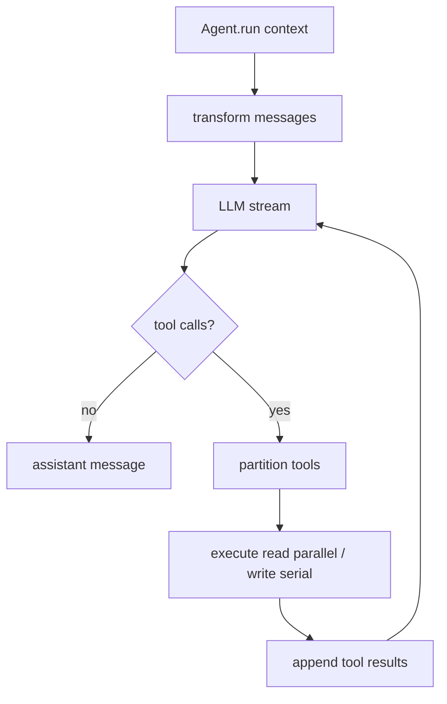

# @x-mars/agent 设计说明

## 设计目标

- 封装单智能体执行循环，负责模型流式输出、工具调用与回合控制。
- 提供状态机驱动的 Agent 生命周期管理。
- 支持只读工具并行执行、写工具串行 + steering 检查的混合执行策略。
- 通过 `DeferredToolManager` 实现工具的延迟发现（tool_search 机制），减少初始 context 占用。
- 将执行层（work-loop.ts）与控制层（agent.ts）完全解耦，便于测试和替换。

## 非目标

- 不负责多 Agent 编排（由 `@x-mars/orchestrator` / `@x-mars/swarm` 承担）。
- 不管理会话持久化。
- 不处理 UI 展示，仅通过 EventEmitter 发射事件供上层消费。

## 实现原理

### Agent 状态机（agent.ts）

`Agent` 继承 `TypedEventEmitter<AgentEvents>`，维护以下状态机：

```
idle ──────────────────→ streaming ──→ tool_executing
  ↑                          ↓               ↓
  └── completed/aborted ←── completed ←─────┘
                                ↓
                              error / aborted
```

通过 `VALID_TRANSITIONS` 表校验转换合法性，非法转换记录 warn 日志并忽略（不抛出）。

状态说明：

- `idle`：等待执行，可调用 `run()`
- `streaming`：正在流式接收 LLM 输出
- `tool_executing`：正在执行工具调用
- `completed`：本次 run 成功完成（可再次调用 `run()`）
- `error`：执行出错（可调用 `run()` 重试或 `reset()`）
- `aborted`：已中止（可调用 `run()` 恢复）

**主要 API**：

- `run(context)` → 触发执行循环，返回 `AssistantMessage`
- `steer(message)` → 向 steering 队列注入转向消息（不中断当前工具执行）
- `followUp(message)` → 注入后续追问，执行完当前工具集后追加
- `abort()` → 中止当前执行
- `reset()` → 重置所有状态（包括 token 计数）
- `getState()` → 返回不可变状态快照

**状态追踪**（通过事件监听内部维护）：

- `turn_count`：累计执行轮次
- `token_usage`：跨轮次累加 input/output/cacheRead token
- `current_stream_message`：当前正在流式构建的消息

### DeferredToolManager（deferred-tools.ts）

延迟工具加载机制，解决工具数量多时 token 占用过大的问题：

- 将部分工具标记为 `deferred`，不在初始 tool list 中传给 LLM。
- 注入一个 `tool_search(query)` 工具，Agent 按需搜索并"激活"相关工具。
- `DeferredToolManager.hasDeferredTools` → 判断是否需要注入 tool_search。
- 当 Agent 调用 `tool_search` 时，相关工具被动态加入当前 tool 列表。

### 工作循环（work-loop.ts）

拆分为两个子函数：

**`runTurn(ctx, params, turnIndex)`** — 单次 LLM 调用：

```
1. transformContext(messages)      → 上下文压缩/裁剪（可选）
2. convertToLLM(messages)          → AgentMessage[] → LLM 格式
3. devtools.pause('model_before')  → 可修改 params（temperature/maxTokens 等）
4. stream(streamContext, signal)   → for-await-of 消费 StreamEvent
5. emitter.emit('stream_event')    → 转发事件
6. devtools.pause('model_after')   → 快照记录
7. return assistantMessage
```

**`runTools(assistantMessage, ctx, turnIndex)`** — 单次工具调度：

```
1. 分类 toolCalls → readOnlyCalls（readonly=true）+ mutationCalls
2. 检查 steering 队列 → 有消息则注入并返回 { steeringInjected: true }
3. readOnlyCalls → Promise.all（并行）
4. mutationCalls → for-of 串行：
   - 每次前检查 steering 队列
   - devtools.pause('tool_before')
   - toolExecutor.execute(toolCall, signal)
   - messages.push(toolResultMessage)
   - devtools.pause('tool_after')
5. return { steeringInjected: false }
```

**`workLoop(context)`** — 外层编排：

```
while true:
  status = streaming
  assistantMessage = await runTurn(...)
  messages.push(assistantMessage)
  emitter.emit('turn_end')

  if !hasToolCalls(assistantMessage): break

  toolTurnCount++
  if toolTurnCount > maxToolTurns: throw MaxToolTurnsError

  status = tool_executing
  result = await runTools(...)

  if result.steeringInjected: continue  // 下轮会读到 steering 消息

  followUpMessages = await getFollowUpMessages()
  if followUpMessages.length > 0:
    messages.push(...followUpMessages)
    continue  // 追加后续追问继续循环

return lastAssistantMessage
```

### 工具执行器（tool-executor.ts）

`ToolExecutor` 执行管线：

1. 按名称从 `tools` 列表解析工具
2. 执行 `toolHookExecutor.beforeAll(input)` → Hook 前置（含权限检查、参数变换）
3. Zod schema 校验参数
4. 调用 `tool.execute(args, context)`
5. 执行 `toolHookExecutor.afterAll(output)` → Hook 后置
6. 返回 `ToolResult { content, isError, details }`

### 工具分区（tool-partitioner.ts）

`partitionToolCalls(toolCalls, toolDefs)` 将工具调用按并发安全性分组为 `ToolBatch[]`：

- `{ isConcurrencySafe: true, toolCalls }` → 全是 readonly 工具，可并行
- `{ isConcurrencySafe: false, toolCalls: [single] }` → 单个 mutation 工具

### 并发控制（concurrency.ts）

`limitConcurrency(tasks, concurrency)` 通用并发限制器，控制最多 N 个 Promise 并发执行。

## 调用链路

### 完整执行流程

```
调用方（AgentSession）
       │
  agent.run(context)
       │
  Agent.runLoop(context)
       │  创建 AbortController + DeferredToolManager + ToolExecutor
       │
  workLoop(WorkLoopContext)
       │
  ┌────── 循环 ──────┐
  │ runTurn()        │
  │  │               │
  │  ├── transformContext(messages)  ← hooks.messages.transform
  │  ├── convertToLLM(messages)
  │  ├── stream(streamContext, signal)
  │  │    └── ProviderRegistry → SSE/SDK → StreamEvent[]
  │  ├── emit('stream_event' × N)
  │  └── return AssistantMessage
  │                  │
  │ messages.push(assistantMessage)
  │ emit('turn_end')
  │                  │
  │ hasToolCalls?    │
  │    否 → break    │
  │    是 ↓          │
  │ runTools()       │
  │  │               │
  │  ├── readOnlyCalls → Promise.all(executeSingleTool)
  │  └── mutationCalls → for-of → 检查 steering → executeSingleTool
  │        └── toolExecutor.execute(toolCall, signal)
  │             └── hooks.before → tool.execute → hooks.after
  │                  │
  │ steeringInjected? → continue
  │ followUp? → continue
  └──────────────────┘
       │
  agent.transitionTo('completed')
       │
  return AssistantMessage
```

### Steering 注入流程

```
外部调用 agent.steer(message)
       │
  steeringQueue.push(message)
       │
  下一次 runTools() 调用时
       │
  getSteeringMessages() 排空队列
       │
  messages.push(...steeringMessages)
  emit('steering_injected')
  return { steeringInjected: true }
       │
  workLoop 识别到 steeringInjected → 跳过工具执行，继续下一轮 LLM 调用
       │
  LLM 接收到 steering 消息，调整行为
```

## 模块分层

| 文件                      | 职责                                                                 |
| ------------------------- | -------------------------------------------------------------------- |
| `src/types.ts`            | AgentTool / AgentOptions / AgentEvent / AgentState 等核心类型        |
| `src/agent.ts`            | Agent 状态机 + 事件发射 + 执行入口                                   |
| `src/work-loop.ts`        | 核心执行循环：runTurn / runTools / workLoop                          |
| `src/tool-executor.ts`    | 工具执行管线（Hook 前后置 + Zod 校验）                               |
| `src/tool-partitioner.ts` | 按并发安全性分组工具调用                                             |
| `src/concurrency.ts`      | 通用并发限制器                                                       |
| `src/deferred-tools.ts`   | 延迟工具加载 + tool_search 注入                                      |
| `src/session-events.ts`   | AgentSession 事件类型定义（供 coding 层使用）                        |
| `src/errors.ts`           | AgentLoopError / ToolExecutionError / AbortError / MaxToolTurnsError |
| `src/index.ts`            | barrel 导出                                                          |

## 入口与依赖

- **入口**：`src/index.ts`
- **内部依赖**：`@x-mars/ai`、`@x-mars/shared`、`@x-mars/devtools`（可选）
- **外部依赖**：`zod`

## 测试策略

- 测试文件数：5
- 覆盖：Agent 工厂、Agent 执行循环、Agent 状态机、错误类型、工具执行器
- 不使用 mock/spy，通过构造轻量 Stub 实现 stream 函数替代真实 Provider

## 非目标

- 不负责多 Agent 编排（由 `@x-mars/orchestrator` / `@x-mars/swarm` 承担）。
- 不管理会话持久化。

## 实现原理

### Agent 状态机（agent.ts）

Agent 类基于 `TypedEventEmitter` 实现 15 种生命周期事件的发射。核心状态：`idle -> streaming -> tool_executing -> completed/error/aborted`。通过 `VALID_TRANSITIONS` 表校验合法状态转换。

关键能力：

- `run(context)`：主执行入口，修改消息数组（in-place）
- `steer(message)`：执行中注入转向消息
- `followUp(message)`：注入后续追问
- `abort()`：优雅中止
- `getState()`：不可变状态快照

### 工作循环（work-loop.ts）

核心算法：

```
while true:
  1. 上下文变换（压缩/裁剪）
  2. AgentMessage[] -> LLM Message[] 格式转换
  3. 调用 LLM stream() -> AssistantMessage
  4. 检查是否有工具调用：
     有 ->
       a. 检查 steering 队列 -> 有则注入并中断
       b. 分离工具：readonly（并行） vs mutation（串行+方向检查）
       c. 执行 readonly 工具（Promise.all）
       d. 串行执行 mutation 工具，每个之间检查 steering
       e. 推入 tool_result 消息
     无 -> 退出循环
  5. 检查 followUp 队列 -> 有则追加并继续循环
  end
返回最后的 AssistantMessage
```

关键特性：

- **Readonly 并行优化**：标记 `readonly: true` 的工具并行执行
- **Mutation 安全串行**：写工具按序执行，每个之间检查转向队列
- **Token 累计**：跨回合累加 input/output/cacheRead token
- **断点集成**：关键阶段提供暂停点（loop_start / model_before / tool_before 等）

### 工具执行器（tool-executor.ts）

执行管线：

1. 按名称解析工具
2. 执行 beforeHooks（权限检查、参数变换）
3. Zod schema 参数校验
4. 执行 `tool.execute(context)`
5. 执行 afterHooks（日志、分析、结果变换）
6. 返回 ToolResult

### 错误类型（errors.ts）

- `AgentLoopError`：执行循环错误（附带当前回合信息）
- `ToolExecutionError`：工具执行错误（附带工具名和参数）
- `AbortError`：用户主动中止
- `MaxToolTurnsError`：超出最大工具回合数

## 实现流程

```
调用方 --> agent.run(context)
              |
        WorkLoop 开始
              |
  [循环] LLM stream() --> AssistantMessage
              |
        有工具调用?
       /           \
      是             否
      |              |
  分离 readonly      退出循环
  / mutation         |
  |                  返回 lastAssistantMessage
  并行执行 readonly
  串行执行 mutation（含 steering 检查）
  推入 tool_result
  继续循环
```

## 模块分层

| 文件                   | 职责                                                          |
| ---------------------- | ------------------------------------------------------------- |
| `src/types.ts`         | AgentTool / AgentOptions / AgentEvent / AgentState 等核心类型 |
| `src/agent.ts`         | Agent 状态机 + 事件发射                                       |
| `src/agent-factory.ts` | 基于 Registry 的 Agent 工厂                                   |
| `src/work-loop.ts`     | 核心执行循环算法                                              |
| `src/tool-executor.ts` | 工具执行管线（Hook 前后置）                                   |
| `src/errors.ts`        | 4 种专用错误类                                                |
| `src/index.ts`         | barrel 导出                                                   |

## 入口与依赖

- **入口**：`src/index.ts`
- **内部依赖**：`@x-mars/ai`、`@x-mars/setting`、`@x-mars/shared`、`@x-mars/invariant`、`@x-mars/devtools`
- **外部依赖**：无

## 测试策略

- 测试文件数：5
- 覆盖：Agent 工厂、Agent 循环、Agent 状态机、错误类型、工具执行器

## 模块设计基线

### 设计目的

封装单 Agent 的模型调用、工具执行、回合推进和状态事件，是运行时最小执行单元。它把上层传入的消息、工具、Hook 和模型流组合为可恢复、可观测、可中止的工作循环。

### 接口设计

- `Agent` / `createAgent()`：创建并运行单 Agent。
- `run(context)` / `abort()` / `steer()` / `followUp()`：控制一次或多次回合执行。
- `ToolExecutor` / `partitionToolCalls()`：将工具调用按只读并行、写入串行的策略执行。
- `AgentEvents`：向 session、service、devtools 转发流事件、工具事件和生命周期事件。

### 方法论

以状态机约束生命周期，以事件流暴露可观测性，以工具分区降低并发风险；所有副作用必须通过工具执行器和 Hook 网关。

### 实现逻辑

Agent 先构造模型请求，再消费流式输出；若模型返回工具调用，则进入工具执行阶段并把结果回填消息列表，直到 stop reason 表示结束或达到最大轮次。

### 流程逻辑图


