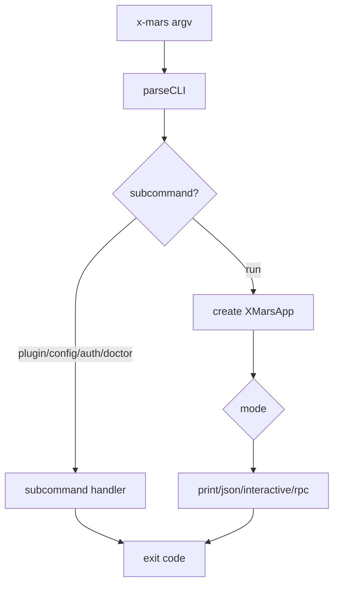

# @x-mars/cli 设计说明

## 设计目标

- 提供 X-Mars 的命令行入口，解析参数并分发到对应运行模式。
- 支持多种输出模式：Print / JSON / Interactive / RPC。
- 支持子命令：run / doctor / config / auth。

## 非目标

- 不实现业务逻辑（由 `@x-mars/coding` XMarsApp 提供）。
- 不负责网络传输（由 `@x-mars/service` 完成）。

## 实现原理

### 参数解析（parse-cli.ts）

`parseCLI(argv: string[])` 返回 `{ options, subCommand, subCommandArgs }`：

**输出模式标志**：

| 标志             | 模式        | 说明                                  |
| ---------------- | ----------- | ------------------------------------- |
| 无标志           | interactive | 默认交互式 REPL                       |
| `-p` / `--print` | print       | 单次执行，文本流式输出到 stdout       |
| `--json`         | json        | 单次执行，JSON 事件流输出             |
| `--rpc`          | rpc         | JSON-RPC stdin/stdout（供父进程控制） |

**其他参数**：

- `-m` / `--model`：覆盖默认模型 ID
- `-c` / `--config`：指定配置文件路径（否则按标准查找）
- `-d` / `--dir`：覆盖工作目录（默认 `process.cwd()`）
- `-v` / `--verbose`：启用 debug 级别日志
- `--max-tokens`：覆盖 maxTokens
- `--continue` / `--resume`：继续上次会话（加载最新 session）
- `--inspect [port]`：启用 devtools（默认端口 9229）
- `--session`：指定 session ID

**子命令**（`subCommand`）：

```
x-mars run [message]     → 默认（执行一次或进入交互）
x-mars doctor            → 环境诊断（Node 版本/依赖/认证/模型可用性）
x-mars config [get|set]  → 配置查看与编辑
x-mars auth [login|logout|status] → 认证管理
```

`subCommandArgs`：子命令后的所有参数（透传给子命令处理器）。

### 运行入口（run-cli.ts）

`runCli(options)` 是主执行入口：

1. 解析参数 → CLI config
2. 创建 XMarsApp（装配所有子系统）
3. 根据模式分发到对应 Runner：
   - Print → `PrintRunner`
   - JSON → `JsonRunner`
   - Interactive → `InteractiveRunner`
   - RPC → `RpcRunner`
4. Runner 执行完毕 → 清理资源

### 子命令

- `doctor`：检查环境（Node 版本、依赖、认证状态、模型可用性）
- `config`：查看/编辑配置
- `auth`：登录/登出/状态查看

### 二进制入口（bin/x-mars）

```
#!/usr/bin/env node
require('../dist/index.js')
```

## 实现流程

```
用户 --> x-mars "fix the bug" -p
            |
       bin/x-mars → 加载 cli/index.js
            |
       parseCLI(process.argv)
            |
       { mode: 'print', message: 'fix the bug', ... }
            |
       runCli(options)
            |
       XMarsApp.create(config)
            |
       PrintRunner.run(app, message)
            |
       app.createSession() → session.chat(message)
            |
       输出结果到 stdout
            |
       清理资源 → 退出
```

## 模块分层

| 文件                     | 职责                        |
| ------------------------ | --------------------------- |
| `src/types.ts`           | CLIOptions / CLIConfig 类型 |
| `src/parse-cli.ts`       | 参数解析                    |
| `src/run-cli.ts`         | 主执行入口 + 模式分发       |
| `src/commands/doctor.ts` | doctor 子命令               |
| `src/commands/config.ts` | config 子命令               |
| `src/commands/auth.ts`   | auth 子命令                 |
| `bin/x-mars`             | 二进制入口                  |
| `src/index.ts`           | barrel 导出                 |

## 入口与依赖

- **入口**：`src/index.ts`、`bin/x-mars`
- **内部依赖**：`@x-mars/coding`、`@x-mars/shared`、`@x-mars/env`
- **外部依赖**：无

## 测试策略

- 测试文件数：3
- 覆盖：参数解析边界、模式分发、子命令基本行为

## 模块设计基线

### 设计目的

提供 `x-mars` 命令行入口，把用户参数、子命令和输出模式转换为 coding runtime 的执行请求。

### 接口设计

- `bin/x-mars`：可执行入口。
- `parseCLI(argv)`：解析 run / doctor / config / auth / plugin 等子命令。
- `runCli()`：创建应用并分发到 print、json、interactive、rpc 模式。
- `runPluginCommand()`：执行插件提供的命令入口。

### 方法论

CLI 只做参数归一化和运行模式分发，不把业务逻辑写入命令层；所有能力通过 `@x-mars/coding` 和插件命令接口获得。

### 实现逻辑

解析 argv 后生成运行配置，初始化 XMarsApp，按模式选择 runner 或子命令处理器，最后返回进程退出码。

### 流程逻辑图


