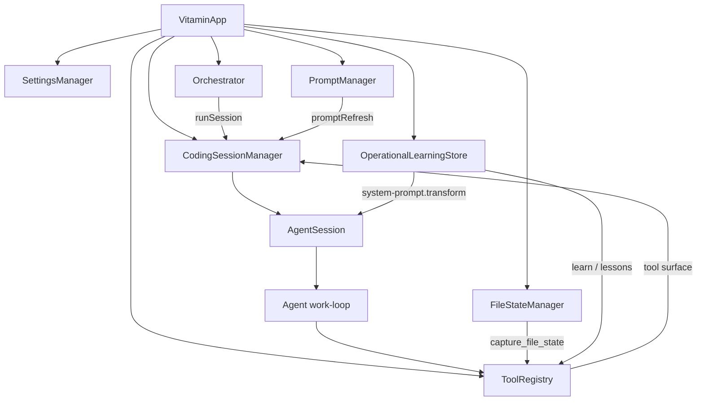

# Vitamin Coding Runtime 设计

最后更新：2026-04-02  
状态：Current Runtime  
范围：@vitamin/coding、@vitamin/orchestrator、@vitamin/tools、@vitamin/prompt、@vitamin/memory

## 1. 文档目标

本文只描述当前代码中已经落地并接入运行路径的设计，不包含历史方案、对比分析或未来目标态。

`@vitamin/coding` 当前的职责是把模型、会话、工具、编排、提示词和 Hook 组装成一个可执行的 coding runtime，并提供两类能力：

- 面向应用容器的 `VitaminApp`
- 面向单会话的 `AgentSession`

## 2. 设计原则

### 2.1 容器负责装配，不负责写死流程

`VitaminApp` 负责创建并连接以下对象：

- `SettingsManager`
- `ProviderRegistry` / `ModelRegistry`
- `HookRegistry`
- `PromptManager`
- `Orchestrator`
- `ToolRegistry`
- `CodingSessionManager`
- `FileStateManager`
- `OperationalLearningStore`

运行时流程由模型结合工具调用决定，容器只提供能力面和默认策略。

### 2.2 Prompt 是运行时产物，不是启动期常量

lead guidance prompt 不是在 `start()` 中一次性构建完成，而是在每次 `AgentSession.prompt()` 前通过 `promptRefresh` 懒组装。这样可以保证：

- prompt section 可以按需加载
- Hook 可以在执行前继续改写 system prompt
- 不同 session 可以共享同一套装配逻辑

### 2.3 编排是回调驱动，不是固定状态机

`@vitamin/orchestrator` 当前通过 `runSession` 回调复用同一套 session runtime，支撑：

- `task_delegate`
- `agent_call`
- `task_create` / `task_get` / `task_list` / `task_update`
- `background_output` / `background_cancel`
- `clarify_request`

是否分发、何时 review、是否后台执行，仍由模型结合 prompt 和工具自行决定。

## 3. 架构总览



## 4. 核心组件

### 4.1 VitaminApp

`VitaminApp` 是顶层容器，负责：

- 初始化基础依赖与默认对象
- 构造 `Orchestrator` 并注入 `runSession`
- 注册 builtin tools
- 将 `PromptManager.assemble()` 作为 session 级 `promptRefresh`
- 注册运行时 Hook
- 对外暴露 session 生命周期 API

`start()` 当前只做两件事：

- 确保 settings 已加载
- 按需启动 devtools

它不会主动加载资源、不会预构建 prompt、也不会预创建 session。

### 4.2 CodingSessionManager

`CodingSessionManager` 负责把底层 `@vitamin/session` 与 `AgentSession` 绑定起来，提供：

- `createSession()`
- `getSession()`
- `listSessions()`
- `removeSession()`
- `forkSession()`
- `save()` / `restore()` / `restoreAll()`

它支持三类底层存储：

- in-memory
- disk
- remote

管理器维护默认的 `model`、`systemPrompt`、`tools`、`maxToolTurns`、`promptRefresh`，并在创建或恢复 session 时统一复用。

### 4.3 AgentSession

`AgentSession` 是单次会话执行单元。一次 `prompt()` 调用会完成：

1. 按需刷新 system prompt
2. 通过 Hook 改写用户消息和模型参数
3. 从 session store 构建上下文
4. 调用 agent work-loop 执行模型推理与工具循环
5. 把新增消息回写到 session
6. 触发 `chat.message.after` 与 `session.idle`

`AgentSession` 还负责桥接：

- streaming 事件
- tool call 事件
- compaction
- error 事件

### 4.4 PromptManager

当前 prompt 由 `@vitamin/prompt` 提供，按 section 组织并按需缓存。默认组装顺序为：

1. `workflow-overview`
2. `phase-discipline`
3. `complexity-routing`
4. `review-guidance`
5. `model-slot-guidance`
6. `file-state-guidance`

`PromptManager` 的职责是：

- 从 provider 加载 prompt 片段
- 做 section 级缓存
- 按顺序 assemble 最终 system prompt

当前 `VitaminApp` 使用本地 provider，读取 `packages/prompt/prompts` 下的内置 prompt 资源。

### 4.5 Orchestrator

`Orchestrator` 当前由以下对象组成：

- `TaskStore`
- `TaskExecutor`
- `BackgroundManager`
- `RetryPolicy`
- `CircuitBreaker`

它不直接创建模型或 agent，而是调用 `VitaminApp` 注入的 `runSession`：

- `sync` 模式：等待子任务完成并返回文本输出
- `background` 模式：创建任务后立即返回，由后台继续执行
- `ephemeral` / `sticky`：决定是否复用子 session
- `slot`：透传到 session 选模逻辑

当前 `TaskStore` 为内存实现，任务状态不会跨进程持久化。

### 4.6 ToolRegistry

`ToolRegistry` 统一注册 builtin tools，并按 preset 暴露：

- `minimal`
- `standard`
- `full`

当前 coding runtime 的 builtin tool 面主要包括：

- 文件与 shell：`read`、`write`、`edit`、`bash`
- 搜索：`ls`、`find`、`grep`
- 编排：`task_delegate`、`agent_call`、`task_*`、`background_*`、`clarify_request`
- 方法论：`write_todos`、`capture_file_state`、`learn`
- 会话：`session_manager`

其中：

- `write_todos` 在未注入回调时使用内存内默认实现
- `capture_file_state` 接到 `FileStateManager`
- `learn` 接到 `OperationalLearningStore`
- skill 工具虽然会先注册，但随后会被 coding runtime 主动移除

### 4.7 Hook 与运行学习

`VitaminApp` 当前注册了三类关键 Hook：

- `system-prompt.transform`
  - 注入历史 lessons
  - 注入 phase context
- `chat.message.after`
  - 从 assistant 输出里提取 `[Phase: ...]`
- `session.idle`
  - 在会话趋于结束时触发学习提示，驱动 `learn` 工具写入经验

这使得方法论能力既能进入 prompt，也能在会话结束时沉淀为长期经验。

### 4.8 ResourceManager

`ResourceManager` 当前仍是 `VitaminApp` 的生命周期成员，但不在主动执行链路上：

- 当前 `start()` 不调用 `resourceManager.load()`
- 当前 `createSession()` 也不消费 `resourceManager.resources`

因此它现在更像保留的资源边界，而不是 session 主路径的一部分。

## 5. 关键运行时流程

### 5.1 启动流程

```text
createVitamin(options)
  -> new VitaminApp(...)
    -> create settings / providers / hooks / prompt / orchestrator / tools / sessions
    -> register runtime hooks

vitamin.start()
  -> ensureSettingsLoaded()
  -> optional devtools.start()
```

### 5.2 会话创建流程

```text
VitaminApp.createSession(options)
  -> ensure settings loaded
  -> resolve model
  -> read per-agent config
  -> filter tools by agent whitelist
  -> create AgentSession via CodingSessionManager
```

模型解析顺序是：

1. `options.model`
2. `options.slot` 或 `agents.<name>.default_workflow_slot`
3. `settings.model_slots`
4. `settings.model`

agent 级覆盖当前支持：

- `system_prompt`
- `tools`
- `max_tool_turns`
- `default_workflow_slot`

### 5.3 一次 prompt 执行流程

```text
AgentSession.prompt(text)
  -> promptRefresh()
  -> chat.message.before
  -> buildContext()
  -> system-prompt.transform
  -> agent.run()
    -> model stream
    -> tool loop
  -> persist new messages
  -> chat.message.after
  -> session.idle
```

### 5.4 工具执行语义

在 agent work-loop 中，工具会按 `readonly` 元数据拆分：

- 只读工具并行执行
- 变更型工具串行执行
- 串行阶段每步都允许插入 steering/follow-up

这条规则是当前 runtime 最明确的并发约束。

## 6. 编排与方法论能力

当前 runtime 已经把以下方法论能力接到真实执行链：

- phase discipline：通过 prompt section + phase extraction/injection 实现
- complexity routing：通过 prompt section 引导模型选择直接执行、轻量计划或任务分发
- review guidance：通过 prompt section 引导模型使用 `agent_call`
- model slot guidance：通过 `slot` 透传到实际 session 选模
- file state refresh：通过 `capture_file_state`
- operational learning：通过 `learn` 与 `session.idle`

换句话说，当前 coding runtime 已经具备“方法论提示 + 工具能力 + 会话/编排复用”的闭环，只是仍保持 LLM 驱动，而没有把这些流程固化成强状态机。

## 7. 当前边界

以下内容不属于当前默认运行事实：

- `start()` 阶段的资源预加载与 prompt 预构建
- 独立的 lead session 专用运行时
- 持久化的 `TaskStore`
- 强制性的 review coordinator
- fleet 级 fan-out / fan-in 执行器
- coding runtime 中的 skill 执行能力

因此当前设计应理解为：

- session runtime 已稳定
- orchestration runtime 已可用
- prompt/methodology 已接入
- 资源与更重的治理能力仍处于边界保留状态

## 8. 一句话总结

`@vitamin/coding` 当前是一个“以 `VitaminApp` 为装配中心、以 `AgentSession` 为执行中心、以 `Orchestrator` 为任务复用中心、以 `PromptManager + Hook` 为方法论承载面”的 coding runtime；它已经具备任务分发、slot 选模、只读并行工具、phase 注入和运行学习，但仍保持轻装配、懒 prompt 和内存任务状态这几个核心边界。
