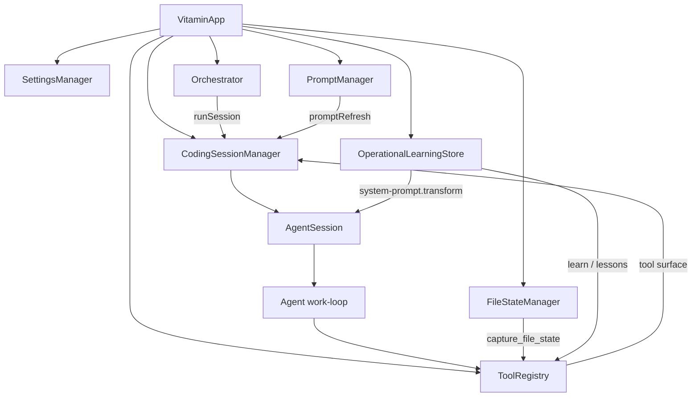
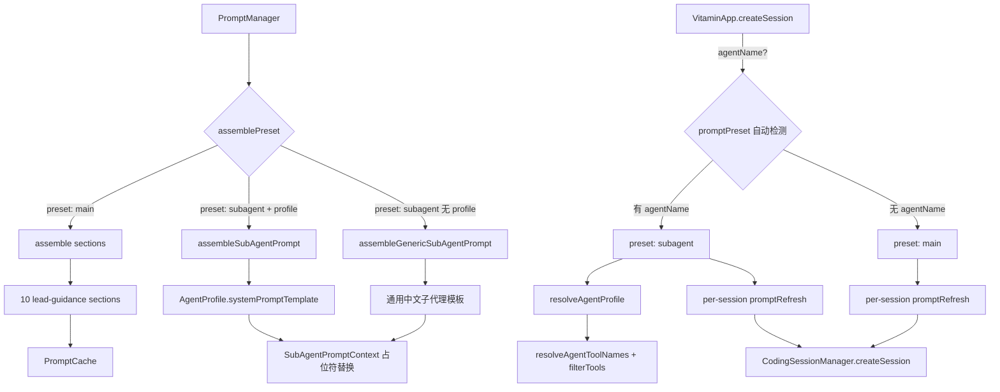

# Vitamin Coding Runtime 设计

最后更新：2026-04-02  
状态：Current Runtime  
范围：@vitamin/coding、@vitamin/orchestrator、@vitamin/tools、@vitamin/prompt、@vitamin/memory

## 1. 文档目标

本文只描述当前代码中已经落地并接入运行路径的设计，不包含历史方案、对比分析或未来目标态。

`@vitamin/coding` 当前的职责是把模型、会话、工具、编排、提示词和 Hook 组装成一个可执行的 coding runtime，并提供两类能力：

- 面向应用容器的 `VitaminApp`
- 面向单会话的 `AgentSession`

## 2. 设计原则

### 2.1 容器负责装配，不负责写死流程

`VitaminApp` 负责创建并连接以下对象：

- `SettingsManager`
- `ProviderRegistry` / `ModelRegistry`
- `HookRegistry`
- `PromptManager`
- `Orchestrator`
- `ToolRegistry`
- `CodingSessionManager`
- `FileStateManager`
- `OperationalLearningStore`

运行时流程由模型结合工具调用决定，容器只提供能力面和默认策略。

### 2.2 Prompt 是运行时产物，不是启动期常量

lead guidance prompt 不是在 `start()` 中一次性构建完成，而是在每次 `AgentSession.prompt()` 前通过 `promptRefresh` 懒组装。这样可以保证：

- prompt section 可以按需加载
- Hook 可以在执行前继续改写 system prompt
- 不同 session 可以共享同一套装配逻辑
- 主代理和子代理使用各自独立的 prompt 组装路径（main preset vs subagent preset）

Prompt preset 在 `createSession()` 时一次性确定并固化到 per-session `promptRefresh` 闭包中，避免运行期间 preset 漂移。

### 2.3 编排是回调驱动，不是固定状态机

`@vitamin/orchestrator` 当前通过 `runSession` 回调复用同一套 session runtime，支撑：

- `task_delegate`
- `agent_task`
- `review_call`（`agent_call` 兼容别名）
- `task_create` / `task_get` / `task_list` / `task_update`
- `background_output` / `background_cancel`
- `clarify_request`

是否分发、何时 review、是否后台执行，仍由模型结合 prompt 和工具自行决定。

## 3. 架构总览



### 3.1 Prompt 组装架构



### 3.2 中文本地化策略

当前 prompt 体系全面使用中文：

| 层次                                | 内容                                      | 语言                 |
| ----------------------------------- | ----------------------------------------- | -------------------- |
| Lead guidance sections（10 个 .md） | 身份定位、安全边界、工具指引等            | 中文                 |
| Agent profile templates（8 个）     | 子代理角色说明 + 执行要求                 | 中文                 |
| 通用子代理模板                      | assembleGenericSubAgentPrompt 输出        | 中文                 |
| 占位符默认值                        | `"未提供"` / `"  - 无"`                   | 中文                 |
| Hook 注入标签                       | 运行环境 / 当前阶段 / 运行经验 / 工具指引 | 中文                 |
| Phase tag 格式                      | `[Phase: Understand]`                     | 英文（用于机器解析） |

Phase tag 保持英文是因为 `extractPhaseFromMessage()` 使用正则匹配，变更格式需要同步改客户端。

## 4. 核心组件

### 4.1 VitaminApp

`VitaminApp` 是顶层容器，负责：

- 初始化基础依赖与默认对象
- 构造 `Orchestrator` 并注入 `runSession`
- 注册 builtin tools
- 将 `PromptManager.assemblePreset()` 作为 session 级 `promptRefresh`，根据 preset 类型分发
- 注册运行时 Hook（tool-guidance / environment / phase / lesson）
- 通过 `createSession()` 自动检测 preset、解析 profile、过滤工具、固化 promptRefresh
- 对外暴露 session 生命周期 API

`start()` 当前只做两件事：

- 确保 settings 已加载
- 按需启动 devtools

它不会主动加载资源、不会预构建 prompt、也不会预创建 session。

### 4.2 CodingSessionManager

`CodingSessionManager` 负责把底层 `@vitamin/session` 与 `AgentSession` 绑定起来，提供：

- `createSession()` — 创建新会话，支持 session 级 `promptRefresh` 覆盖
- `getSession()` / `listSessions()` / `removeSession()`
- `forkSession()` — fork 时携带源 session 的 `promptRefresh`
- `save()` / `restore()` / `restoreAll()`

它支持三类底层存储：

- in-memory（通过 `CodingSessionManager.inMemory()` 静态方法簡化创建）
- disk（`createDiskCodingSessionManager()`）
- remote（`createRemoteCodingSessionManager()`）

管理器维护默认的 `model`、`systemPrompt`、`tools`、`maxToolTurns`、`promptRefresh`，并在创建或恢复 session 时统一复用。每个 session 可以通过 `createSession({ promptRefresh })` 覆盖管理器级别的默认 promptRefresh，这是 subagent 使用独立提示词的关键机制。

### 4.3 AgentSession

`AgentSession` 是单次会话执行单元。一次 `prompt()` 调用会完成：

1. 按需刷新 system prompt
2. 通过 Hook 改写用户消息和模型参数
3. 从 session store 构建上下文
4. 调用 agent work-loop 执行模型推理与工具循环
5. 把新增消息回写到 session
6. 触发 `chat.message.after` 与 `session.idle`

`AgentSession` 还负责桥接：

- streaming 事件
- tool call 事件
- compaction
- error 事件

### 4.4 PromptManager

`@vitamin/prompt` 的 `PromptManager` 负责 system prompt 的加载、缓存和组装。它提供两层 API：

- **`assemble(sections?)`** — 按 section 组装 lead guidance prompt（主代理用）
- **`assemblePreset(options)`** — 根据 preset 类型分发到 main 或 subagent 组装路径

#### 4.4.1 Lead Guidance Prompt（Main Preset）

主代理的 system prompt 由 10 个独立的 markdown section 拼接而成，统一存放在 `packages/prompt/prompts/lead-guidance.md` 中，全部使用中文编写。默认组装顺序为：

| 序号 | Section Key            | 职责         |
| ---- | ---------------------- | ------------ |
| 1    | identityAndEnvironment | 身份与环境   |
| 2    | safetyGuardrails       | 安全与边界   |
| 3    | outputAndCommunication | 输出与沟通   |
| 4    | toolUsageGuidelines    | 工具使用指引 |
| 5    | workflowOverview       | 工作流程引导 |
| 6    | phaseDiscipline        | 阶段纪律     |
| 7    | complexityRouting      | 复杂度路由   |
| 8    | reviewGuidance         | 审查指引     |
| 9    | modelSlotGuidance      | 模型槽位指引 |
| 10   | fileStateGuidance      | 文件状态刷新 |

section 可以通过 `AssembleOptions` 逐个开关，`PromptCache` 保证每个 section 只加载一次。

当前所有 section 存放在一个 markdown 文件中，运行时按 section key 解析并缓存。section 粒度开关通过 `AssembleOptions` 控制，用于不同场景裁剪 prompt。

#### 4.4.2 Prompt Preset 机制

`PromptPreset` 是一个判别联合类型，决定 system prompt 的组装路径：

```typescript
type PromptPreset = 'main' | 'subagent'

type PromptPresetOptions =
  | { preset?: 'main' }
  | {
      preset: 'subagent'
      agentName: string
      profile?: AgentProfile
      context?: SubAgentPromptContext
    }
```

`assemblePreset()` 的分发逻辑：

1. **`preset: 'main'`（默认）** — 调用 `assemble()` 加载完整 lead guidance prompt
2. **`preset: 'subagent'` + `profile`** — 调用 `assembleSubAgentPrompt(profile, context)` 基于 profile 的模板做占位符替换
3. **`preset: 'subagent'` + 无 profile** — 调用 `assembleGenericSubAgentPrompt(agentName, context)` 生成通用子代理提示词

#### 4.4.3 SubAgentPromptContext

子代理上下文由 orchestrator 注入，用于模板占位符替换：

```typescript
interface SubAgentPromptContext {
  taskTitle?: string // → {task_title}
  taskDescription?: string // → {task_description}
  taskFiles?: string[] // → {task_files}
}
```

未提供的占位符统一回退为 `"未提供"` 或 `"  - 无"`，确保子代理始终收到完整结构。

### 4.5 Agent Profile 系统

Agent profile 定义每种专用子代理的能力与配置，存放在 `@vitamin/setting` 的 `agent-profiles.json` 中。

#### 4.5.1 Profile 结构

```typescript
interface AgentProfile {
  name: string // coder | refactorer | tester | debugger | researcher | documenter | reviewer | infra
  taskTypes: string[] // 擅长的任务类型
  capabilities: string[] // 能力关键词（用于模糊匹配）
  systemPromptTemplate: string // 中文模板，含 {task_*} 占位符
  defaultTools?: string[] // 工具白名单（使用 profile 维度名称）
  preferredModelTier?: string // fast | standard | powerful（未来 slot 选模依据）
  defaultMaxToolTurns?: number // 默认最大工具轮次
}
```

当前内置 8 个 profile，其 `systemPromptTemplate` 全部使用中文，包含完整的 "上下文 → 当前任务 → 执行要求" 结构。

#### 4.5.2 Profile 解析

`resolveAgentProfile(profiles, agentName)` 的匹配逻辑：

1. **精确匹配** — `profile.name === agentName`
2. **模糊匹配** — agentName 尾部包含 profile.name（`quality-reviewer` → `reviewer`），或 agentName 包含 capabilities / taskTypes 中的任一关键词

#### 4.5.3 工具名称别名

Profile 中的 `defaultTools` 使用 profile 维度名称（如 `file_read`、`shell`、`search`），需要通过 `resolveAgentToolNames()` 映射到 runtime 实际工具名：

| Profile 名称 | 映射到 Runtime 工具 |
| ------------ | ------------------- |
| file_read    | read                |
| file_write   | write               |
| file_edit    | edit                |
| shell        | bash                |
| search       | ls, find, grep      |

未在别名表中的名称直接透传（如 `find`、`grep`）。

### 4.6 Orchestrator

`Orchestrator` 当前由以下对象组成：

- `TaskStore`
- `TaskExecutor`
- `BackgroundManager`
- `RetryPolicy`
- `CircuitBreaker`

它不直接创建模型或 agent，而是调用 `VitaminApp` 注入的 `runSession`：

- `sync` 模式：等待子任务完成并返回文本输出
- `background` 模式：创建任务后立即返回，由后台继续执行
- `ephemeral` / `sticky`：决定是否复用子 session
- `slot`：透传到 session 选模逻辑

当前 `TaskStore` 为内存实现，任务状态不会跨进程持久化。

### 4.7 ToolRegistry

`ToolRegistry` 统一注册 builtin tools，并按 preset 暴露：

- `minimal`
- `standard`
- `full`

当前 coding runtime 的 builtin tool 面主要包括：

- 文件与 shell：`read`、`write`、`edit`、`bash`
- 搜索：`ls`、`find`、`grep`
- 编排：`task_delegate`、`agent_task`、`review_call`、`agent_call`、`task_*`、`background_*`、`clarify_request`
- 方法论：`write_todos`、`capture_file_state`、`learn`
- 会话：`session_manager`

其中：

- `write_todos` 是纯 UI/记忆工具，接到 Orchestrator 的 session-scoped 内存 todo 列表
- `capture_file_state` 接到 `FileStateManager`
- `learn` 接到 `OperationalLearningStore`
- skill 工具虽然会先注册，但随后会被 coding runtime 主动移除

### 4.8 Hook 与运行学习

`VitaminApp` 当前注册了六个关键 Hook，分三类时机：

#### system-prompt.transform（每次 prompt 前改写 system prompt）

| Hook 名称               | Priority | 行为                                              |
| ----------------------- | -------- | ------------------------------------------------- |
| tool-guidance-injection | 20       | 注入当前 tool preset 的使用指引和示例             |
| environment-injection   | 25       | 注入运行环境信息（工作目录、平台、Git 分支/状态） |
| phase-injection         | 30       | 注入当前阶段标注与阶段历史                        |
| lesson-injection        | 40       | 注入运行经验（通过 learn 工具积累的教训）         |

#### chat.message.after（模型回复后提取信息）

| Hook 名称        | Priority | 行为                                                      |
| ---------------- | -------- | --------------------------------------------------------- |
| phase-extraction | 50       | 从 assistant 输出中提取 `[Phase: ...]` 标注，维护阶段历史 |

#### session.idle（会话空闲后触发学习）

| Hook 名称            | Priority | 行为                                                              |
| -------------------- | -------- | ----------------------------------------------------------------- |
| session-end-learning | 50       | 加载 session-end learning prompt，驱动模型通过 learn 工具沉淀经验 |

这使得方法论能力既能进入 prompt（环境 + 阶段 + 经验 + 工具指引），也能在会话结束时沉淀为长期经验。所有注入内容使用中文，与 lead guidance prompt 保持一致。

### 4.9 ResourceManager

`ResourceManager` 当前仍是 `VitaminApp` 的生命周期成员，但不在主动执行链路上：

- 当前 `start()` 不调用 `resourceManager.load()`
- 当前 `createSession()` 也不消费 `resourceManager.resources`

因此它现在更像保留的资源边界，而不是 session 主路径的一部分。

## 5. 关键运行时流程

### 5.1 启动流程

```text
createVitamin(options)
  -> new VitaminApp(...)
    -> create settings / providers / hooks / prompt / orchestrator / tools / sessions
    -> register runtime hooks

vitamin.start()
  -> ensureSettingsLoaded()
  -> optional devtools.start()
```

### 5.2 会话创建流程

```text
VitaminApp.createSession(options)
  -> ensure settings loaded
  -> resolve promptPreset + agentProfile (before model, so tier is available)
  -> resolveSessionModel(model, agentName, slot, modelTier)
  -> read per-agent config (settings.agents.<name>)
  ┌─ prompt preset + tool resolution ───────────────────────────────
  │  promptPreset = options.promptPreset ?? (agentName ? 'subagent' : 'main')
  │  if subagent:
  │    agentProfile = resolveAgentProfile(BUILTIN_AGENT_PROFILES, agentName)
  │    agentToolNames = agentConfig.tools ?? resolveAgentToolNames(profile.defaultTools)
  │    tools = filterToolsByNames(allTools, agentToolNames)
  │    promptRefresh → assemblePreset({ preset: 'subagent', agentName, profile, context })
  │  else:
  │    promptRefresh → assemblePreset({ preset: 'main' })
  └─────────────────────────────────────────────────────────────────
  -> compute initialSystemPrompt via resolvedPromptRefresh()
  -> CodingSessionManager.createSession({ ..., promptRefresh })
```

Preset 自动检测的依据是 `agentName`：如果调用方传入了 `agentName`，默认使用 subagent preset；否则使用 main preset。调用方也可以通过 `promptPreset: 'main'` 强制覆盖。

per-session `promptRefresh` 闭包捕获了创建时的 preset / profile / context，确保后续的 prompt 刷新始终走同一条组装路径。

模型解析顺序是：

1. `options.model`（调用方显式指定）
2. `options.slot` 或 `agents.<name>.default_workflow_slot`（settings 级显式绑定）
3. `agentProfile.preferredModelTier` → WorkflowSlot 映射（`fast→compact`、`standard→normal`、`powerful→thinking`）
4. `settings.model_slots` → 默认 slot 解析
5. `settings.model`
6. `VitaminApp.defaultModel`（构造函数传入）

agent 级覆盖当前支持：

- `system_prompt`
- `tools`
- `max_tool_turns`
- `default_workflow_slot`

### 5.3 一次 prompt 执行流程

```text
AgentSession.prompt(text)
  -> promptRefresh()
  -> chat.message.before
  -> buildContext()
  -> system-prompt.transform
  -> agent.run()
    -> model stream
    -> tool loop
  -> persist new messages
  -> chat.message.after
  -> session.idle
```

### 5.4 工具执行语义

在 agent work-loop 中，工具会按 `readonly` 元数据拆分：

- 只读工具并行执行
- 变更型工具串行执行
- 串行阶段每步都允许插入 steering/follow-up

这条规则是当前 runtime 最明确的并发约束。

### 5.5 Orchestrator → SubAgent 上下文注入

当 Orchestrator.dispatchTask 接收到任务委派时：

```text
dispatchTask(args: { prompt, subagent, category, mode, slot, ... })
  -> executor.dispatch(args)
  -> TaskStore.create(input)
  -> runSession({ prompt, agentName, slot })
  -> VitaminApp.createSession({ agentName, slot })
  -> resolveAgentProfile → assemble SubAgentPromptContext:
       taskTitle = 从 prompt/context 提取
       taskDescription = 从 prompt/context 提取
       taskFiles = 从 prompt/context 提取
  -> assemblePreset({ preset: 'subagent', agentName, profile, context })
  -> profile.systemPromptTemplate 占位符替换
```

这条链路确保子代理的 system prompt 通过 profile 模板获得任务上下文。

## 6. 编排与方法论能力

当前 runtime 已经把以下方法论能力接到真实执行链：

- phase discipline：通过 prompt section + phase extraction/injection 实现
- complexity routing：通过 prompt section 引导模型选择直接执行、轻量计划或任务分发
- review guidance：通过 prompt section 引导模型使用 `review_call`
- model slot guidance：通过 `slot` 透传到实际 session 选模
- file state refresh：通过 `capture_file_state`
- operational learning：通过 `learn` 与 `session.idle`
- **prompt preset 分发**：主代理使用 lead guidance、子代理使用 profile 模板或通用模板
- **agent profile 解析**：根据 agentName 自动匹配 profile、映射工具白名单、注入 maxToolTurns
- **per-session promptRefresh**：每个 session 固化独立的 prompt 组装闭包，不受其他 session 影响

换句话说，当前 coding runtime 已经具备"方法论提示 + 工具能力 + 会话/编排复用 + 主/子代理 prompt 隔离"的闭环，只是仍保持 LLM 驱动，而没有把这些流程固化成强状态机。

## 7. 关键运行约束

- 当前 `TaskStore` 为内存实现，不跨进程持久化
- `write_todos` 是纯 UI/记忆工具，按 session 维护内存 todo 列表（`Map<string, TodoItem[]>`），不驱动执行链路
- skill 相关工具虽然注册但随后移除，当前 runtime 无 skill 执行能力

## 8. 当前边界

以下内容不属于当前默认运行事实：

- `start()` 阶段的资源预加载与 prompt 预构建
- 独立的 lead session 专用运行时
- 强制性的 review coordinator
- fleet 级 fan-out / fan-in 执行器
- coding runtime 中的 skill 执行能力

因此当前设计应理解为：

- session runtime 已稳定
- orchestration runtime 已可用，task → subagent 上下文注入已落地
- prompt/methodology 已接入，主/子代理 prompt 隔离已落地
- agent profile 系统已接入，profile 解析 + 工具映射 + 模板组装 + modelTier→slot 映射已落地
- 资源与更重的治理能力仍处于边界保留状态

## 9. 一句话总结

`@vitamin/coding` 当前是一个"以 `VitaminApp` 为装配中心、以 `AgentSession` 为执行中心、以 `Orchestrator` 为任务复用中心、以 `PromptManager + AgentProfile + Hook` 为方法论承载面"的 coding runtime；它已经具备主/子代理 prompt 自动分发、agent profile 模板组装、`write_todos` 纯 UI/记忆规划工具、`task_delegate` prompt-based 直接分发、preferredModelTier 自动选模、slot 透传、只读并行工具、phase 注入和运行学习的完整闭环。
