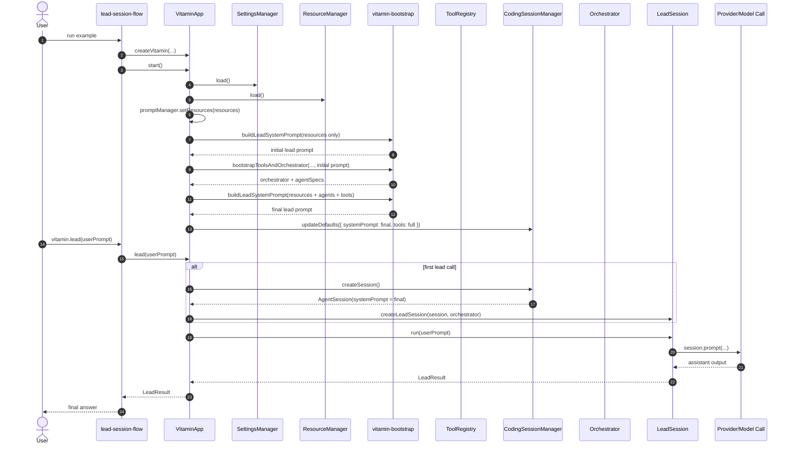

# Lead Agent Flow

相关文档：

- [packages/orchestrator/DESIGN.md](../../orchestrator/DESIGN.md) 记录了当前 orchestrator 的源码审校结论与目标任务调度器设计。

这份文档只描述当前源码里已经验证的 lead 装配链，不把 README 里的目标态或占位目录写成默认 runtime 事实。

## 核心结论

- [lead-session-flow.ts](../example/lead-session-flow.ts) 是产品入口示例，不是装配脚本。
- lead system prompt 的真实构建位置在 [vitamin-app.ts](../src/app/vitamin-app.ts) 的 `start()`。
- prompt 当前是两阶段运行时装配：
  - 第一阶段：资源就绪后构建初始 prompt
  - 第二阶段：tools 和 orchestrator 就绪后构建最终 prompt
- 当前 CLI 默认用户入口也已经对齐到 `vitamin.lead()`；只有 `rpc` 仍保留 session 级路径。

## Runtime Sequence

## 为什么入口示例看不到 Prompt Build

[lead-session-flow.ts](../example/lead-session-flow.ts) 只做两件事：

- 调 `createVitamin()` 构造应用容器
- 调 `vitamin.start()` 和 `vitamin.lead()` 触发运行时

真正的 prompt build 发生在 [vitamin-app.ts](../src/app/vitamin-app.ts) 内部，所以只看入口示例会误以为没有 lead prompt 装配。

## Prompt Assembly Boundaries

### 1. ResourceManager

[resource-manager.ts](../src/resources/resource-manager.ts) 当前负责：

- 通过 `@vitamin/memory` 载入 persistent memory
- 生成 `agentInstructions`
- 发现 prompt templates

当前它不会像旧版文档那样统一加载 skills 或扩展资源。

### 2. PromptManager

[prompt-manager.ts](../src/lead/prompt-manager.ts) 当前把以下信息拼成 prompt：

- `customSystemPrompt`
- `agentInstructions`
- `roleInstructions`
- `agentCatalog`
- `toolCatalog`

对 lead prompt 来说，拼接顺序是：

1. 用户 / 配置级自定义 system prompt
2. `agentInstructions`
3. lead 角色说明
4. agent catalog
5. tool catalog

### 3. VitaminApp Runtime Helpers

[vitamin-app.ts](../src/app/vitamin-app.ts) 当前在类内部提供：

- `buildLeadSystemPrompt()`
- `summarizeAgentCatalog()`
- `summarizeToolCatalog()`
- `createOrchestratorRuntime()`

当前源码里已经直接验证到的 runtime catalog 只有：

- agent catalog
- tool catalog

## 推荐入口与当前 CLI 的关系

要分清三层：

- 从 `@vitamin/coding` 的产品 / API 设计看，推荐入口是 `vitamin.lead()`。
- 从当前 CLI 实现看，`print/json/interactive` 默认也已经走 `app.lead()`；只有 `rpc` 仍保留 session 级路径。
- `runPrintMode`、`runJsonMode`、`InteractiveMode` 这些 session 级辅助函数仍然存在，但它们不等同于当前默认 CLI 用户入口。

所以现在不能再把“CLI 默认仍走 session 模式”写成事实；真正需要分清的是“lead 用户入口”“session 级 SDK 辅助函数”“内部控制面 / rpc 占位路径”这三层。

## 对照参考项目后的稳定判断

### 当前已经对齐的部分

- 像 superpowers 一样，把 plan、delegate、review 的职责放进 lead 角色契约。
- 像 deepagents 一样，把 tool / agent surface 作为 runtime catalog 注入 prompt，而不是写死为静态常量。
- 像 pi-mono 一样，把 prompt 看成运行时产物，而不是一次性初始化字符串。

### 当前还不该写满的部分

- 不应把 MCP 叙事写成当前 `start()` 已验证步骤。
- 不应把当前 CLI 默认路径写成已经 lead 产品化。

## 最值得记住的一条

如果问题是“为什么 lead-session-flow 看起来没走到 lead system prompt 构建”，正确答案不是“链路断了”，而是：

> 产品入口文件只负责触发流程；真正的 lead prompt 构建发生在 `VitaminApp.start()` 的运行时装配阶段，并且会在 tools / orchestrator 就绪后再构建一次最终版本。
