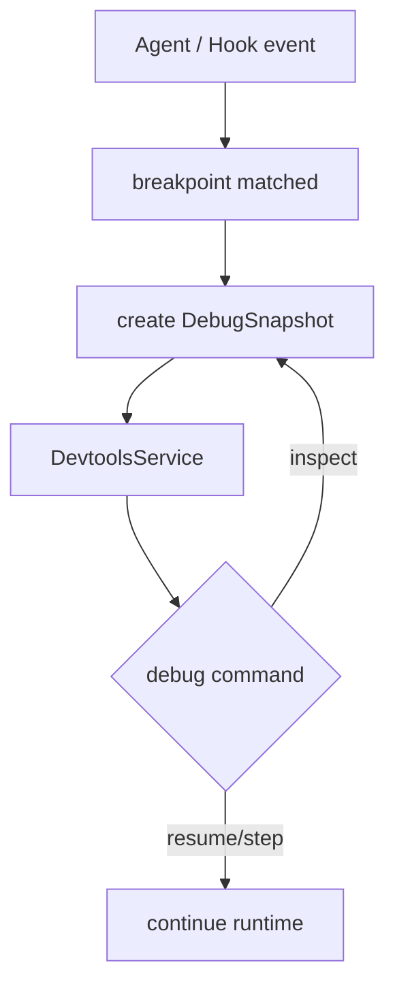

# @x-mars/devtools 设计说明

## 设计目标

- 提供 Agent 调试基础设施：断点、快照、步进控制。
- 通过 Worker 线程隔离检测服务，不干扰主执行流。
- 支持 23 个断点位置覆盖 Agent 执行的各关键阶段。

## 非目标

- 不实现前端调试 UI；仅提供调试协议和运行时控制能力。
- 不替代日志系统（与 `@x-mars/shared` logger 互补）。

## 实现原理

### Devtools（devtools.ts）

顶层组合类，封装所有调试子系统的初始化与协调：

- `Devtools` 组合 `InspectorService`（Worker 线程）+ `Breakpoints` + `Debugger` + `SnapshotRecorder`
- `start()` → 启动 Worker 线程 → 初始化所有断点 → 向 HookRegistry 注册 Hook
- `stop()` → 清理所有资源（Worker / 监听器 / 断点）
- `getSnapshot()` → 当前调试状态快照（最新 DebugSnapshot）

`debugger.pause(point, data)` 是核心暂停点：被断点 Hook 调用，内部通过 Promise 挂起执行流，直到 `debugger.resume(command)` 或超时。这使得 Agent 工作循环真正暂停在断点位置，而非仅记录事件。

### 断点系统（breakpoints.ts）

23 个断点位置分 5 个类别：

| 类别           | 断点                                                                            |
| -------------- | ------------------------------------------------------------------------------- |
| Agent 生命周期 | `agent:init` / `agent:start` / `agent:end` / `agent:error`                      |
| 回合控制       | `turn:start` / `turn:end` / `turn:model_before` / `turn:model_after`            |
| 工具执行       | `tool:before` / `tool:after` / `tool:validate` / `tool:error`                   |
| 消息处理       | `message:before` / `message:after` / `message:transform`                        |
| 系统           | `compaction:before` / `compaction:after` / `session:save` / `session:load` / 等 |

每个断点可启用/禁用，支持条件表达式（如仅在特定工具触发时暂停）。

### DebugSnapshot（debug-snapshot.ts）

调试快照数据结构：

```ts
interface DebugSnapshot {
  turn: number
  point: BreakpointName
  messages: AgentMessage[]
  tokens: { input: number; output: number }
  params?: Record<string, unknown>
  timestamp: number
}
```

### 调试命令（debugger.ts）

`Debugger` 提供步进控制：

- `next()` → 继续到下一个断点
- `step()` → 单步执行
- `over()` → 跳过当前工具调用
- `continue()` → 继续执行直到下一个断点
- `stop()` → 停止执行

### PauseResumePayload

断点暂停时可修改状态：

- 修改系统提示
- 修改工具参数
- 注入额外消息
- 修改模型参数

### Service（Worker 线程）

`InspectorService` 在独立 Worker 线程中运行：

- 通过 `worker_threads` 隔离
- WebSocket 协议与主线程通信
- 避免调试操作阻塞 Agent 执行

## 实现流程

```
XMarsApp 初始化
       |
  Devtools.start()
       |
  启动 Worker（InspectorService）
       |
  注册 23 个断点到 HookRegistry
       |
  Agent 执行 → 触发断点
       |
  断点启用? → 暂停执行
       |
  创建 DebugSnapshot
       |
  通过 Worker → WebSocket 推送到调试客户端
       |
  等待调试命令（next/step/over/continue/stop）
       |
  可选：应用 PauseResumePayload 修改
       |
  恢复执行
```

## 模块分层

| 文件                    | 职责                                               |
| ----------------------- | -------------------------------------------------- |
| `src/types.ts`          | BreakpointName / DebugSnapshot / DebugCommand 类型 |
| `src/devtools.ts`       | 顶层组合类                                         |
| `src/breakpoints.ts`    | 23 个断点 + 条件系统                               |
| `src/debug-snapshot.ts` | 快照数据结构                                       |
| `src/debugger.ts`       | 步进控制命令                                       |
| `src/service.ts`        | Worker 线程检测服务                                |
| `src/index.ts`          | barrel 导出                                        |

## 入口与依赖

- **入口**：`src/index.ts`
- **内部依赖**：`@x-mars/hooks`、`@x-mars/shared`、`@x-mars/env`、`@x-mars/invariant`
- **外部依赖**：无（仅 Node.js worker_threads）

## 测试策略

- 测试文件数：4
- 覆盖：断点注册/启用/条件、快照生成、步进控制、Worker 通信

## 模块设计基线

### 设计目的

提供运行时调试、断点、快照和审计回放能力，使 Agent 执行流程可以被暂停、观察和复现。

### 接口设计

- `DevtoolsService` / `Service`：调试服务生命周期与连接管理。
- `BREAKPOINT_POINTS` / `DebugSnapshot`：断点定义与快照结构。
- `Debugger` tools：breakpoints、resume、step、continue 等控制工具。
- `AuditTraceRecorder` / `replayAuditTrace()`：记录并重放审计事件。

### 方法论

调试能力以 Hook/事件旁路接入，不侵入 Agent 核心逻辑；暂停点必须携带可序列化快照，便于 UI 和测试消费。

### 实现逻辑

运行时触发断点后生成快照并等待调试命令；调试服务接收命令后恢复、单步或修改 payload，再把控制权交还给执行循环。

### 流程逻辑图


