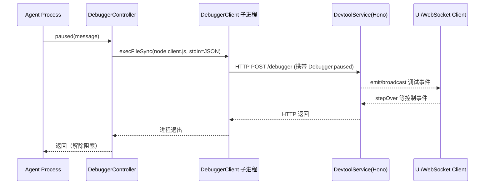

# @vitamin/devtools

面向 vitamin 框架的 Agent 调试基础设施（最新实现版）。

当前实现由三部分组成：

- `DebuggerController`：运行在 Agent 进程中，负责在断点处触发调试（可同步阻塞）。
- `DebuggerClient`：由 Controller 拉起的子进程，负责把调试事件转发到调试服务。
- `DevtoolService`：基于 `Hono` + `ws` 的调试服务，提供 `/debugger`、`/logger`、`/session` 路由与广播能力。

---

## 1. 当前目录结构

```text
src/
  debugger/
    client.ts
    controller.ts
    index.ts
    path.ts
  routes/
    debugger.ts
    logger.ts
    session.ts
    index.ts
  service.ts
  protocol.ts
  types.ts
  devtools.ts
  index.ts
```

---

## 2. 同步阻塞设计（当前版本）

`DebuggerController.paused()` 内部使用 `execFileSync('node', [resolveDebugClientPath()], ...)`。

这意味着：

- 当 Agent 命中断点并调用 `paused()` 时，父进程会**同步等待**子进程退出。
- 只有当 `DebuggerClient` 处理完消息并退出后，Agent 才继续执行。

这是当前实现里“同步阻塞”的核心机制。

---

## 3. 核心流程



---

## 4. 关键模块说明

### 4.1 `DebuggerController`

文件：`src/debugger/controller.ts`

- 保存 `serviceUrl`。
- 在 `paused(message)` 中同步拉起 client：
  - 子进程 stdin 输入：`{ serviceUrl, type: 'Debugger.paused', payload }`
  - 使用 `execFileSync`，因此天然阻塞调用方。

### 4.2 `DebuggerClient`

文件：`src/debugger/client.ts`

- 从 `stdin` 读取 JSON。
- 按消息类型分发，当前处理 `Debugger.paused`。
- 通过 `fetch(message.service, { method: 'POST', ... })` 上报服务端。

### 4.3 `DevtoolService`

文件：`src/service.ts`

- 启动 `Hono` 应用和 `WebSocketServer`。
- 路由挂载：
  - `/debugger`
  - `/logger`
  - `/session`
- 提供 `broadcast()` 向连接客户端推送消息。

### 4.4 `/debugger` 路由

文件：`src/routes/debugger.ts`

- `GET /paused`：
  - 监听 `Debugger.stepOver`。
  - 触发 `Debugger.paused` 事件。
  - 在收到 stepOver 前保持 Promise 未决（用于等待继续信号）。

---

## 5. 协议类型（当前）

文件：`src/protocol.ts`

- `BreakpointPoint`（snake_case）
  - `loop_start`, `model_before`, `model_after`, `tool_before`, `tool_after`, `loop_end`, `agent_error`, `agent_done`
- `DebuggerEvent`
  - 当前事件类型：`Agent.debugger.paused`
- `DebugCommand`
  - `next | step | over | continue | stop`

---

## 6. 代码示例

### 6.1 Agent 侧触发断点（同步阻塞）

```ts
import { createDevtools } from '@vitamin/devtools'

const devtools = createDevtools(3000)
await devtools.start()

devtools.debugger.paused({
  turn: 3,
  point: 'model_before',
  messagesCount: 12,
})

// paused() 返回前，当前线程不会继续执行
```

### 6.2 启动调试服务

```ts
import { Devtools } from '@vitamin/devtools'

const devtools = new Devtools(3000)
await devtools.start()
```

---

## 7. 依赖

当前 `package.json` 中与该实现相关的依赖：

- `hono`
- `ws`
- `uuid`
- `@vitamin/shared`

---

## 8. 已实现与待完善

### 已实现

- 调试服务骨架（HTTP + WebSocket）。
- 控制器到客户端的同步阻塞触发链路。
- 基础调试事件模型与路由框架。

### 待完善（基于当前源码现状）

- `/logger`、`/session` 路由业务逻辑仍为空。
- `/debugger` 路由目前是最小雏形（仅 paused/stepOver 事件编排）。
- `protocol.ts` 里事件判定与类型声明仍需进一步收敛。
- 包入口导出与子模块导出策略可继续标准化（便于外部稳定引用）。

---

## 9. 建议下一步

1. 固化 `/debugger` 的请求/响应 schema（zod 或手写校验）。
2. 为 `paused -> stepOver -> resume` 增加端到端测试。
3. 把 `DevtoolService` 与 `DebuggerController` 接入 `@vitamin/agent` 的 loop 生命周期。
4. 增加 `next/step/continue/stop` 全指令映射和状态机。
