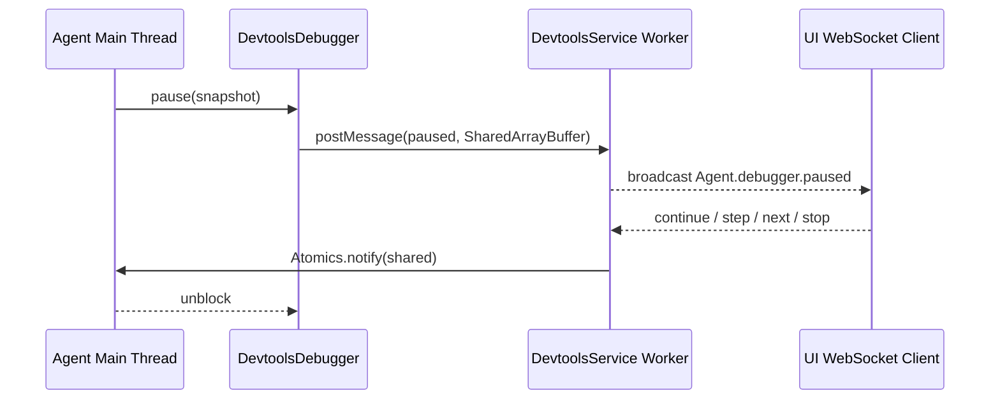

# @vitamin/devtools

面向 vitamin Agent 的最小调试基础设施。

当前实现采用“主线程同步阻塞 + Worker 控制平面”的结构：

- `DevtoolsDebugger` 在 Agent 线程内同步暂停。
- `DevtoolsService` 在独立 Worker 线程内维护 HTTP 和 WebSocket 服务。
- WebSocket 客户端收到 `Agent.debugger.paused` 事件后，发送调试命令以恢复执行。

这样可以保留同步 `pause()` API，同时避免服务端和 Agent 共用同一事件循环导致自锁。

## 当前目录结构

```text
src/
  devtools.ts
  index.ts
  protocol.ts
  service.ts
  tools/
    debugger.ts
    logger.ts
```

## 核心流程



## 服务端点

- `ws://127.0.0.1:{port}/{serviceId}/inspect` — WebSocket 调试通道
- `POST /{serviceId}/command/logger` — 日志广播
- `POST /{serviceId}/command/session` — 会话透传

> ⚠️ **已知偏差**：`DevtoolsService.url` getter 返回 `.../ws` 后缀，
> 但 `service-worker.ts` 的 `handleUpgrade` 实际监听的是 `.../inspect`。
> 实际 WebSocket 连接应使用 `serviceUrl.replace('http://', 'ws://') + '/inspect'`。
>
> `debuggerPauseUrl`（`/{serviceId}/command/debugger/paused`）对应的 HTTP 路由在
> `service-worker.ts` 中尚未实现（`createDebuggerRoute` 返回空 Hono App）；
> 暂停/恢复机制通过 `Atomics.wait()` + Worker postMessage 实现，不经过 HTTP。

## 示例

```ts
import { createDevtools } from '@vitamin/devtools'

const devtools = createDevtools(3000)
await devtools.start()

devtools.debugger.pause({
  turn: 1,
  point: 'model_before',
  frameDepth: 0,
  messagesCount: 3,
})
```

## 当前边界

- 已支持同步暂停、日志广播、基础 WebSocket 控制恢复。
- `pause()` 当前只做“阻塞/恢复”门控，尚未把 `stop`、`step`、`over` 映射为 Agent 行为。
- `session` 通道仍是透传广播，未形成完整会话调试协议。

## 下一步

1. 把调试命令映射进 `@vitamin/agent` 的中止和单步状态机。
2. 为 `pause()` 增加跨线程端到端测试，覆盖真实同步阻塞恢复。
3. 为 logger/session/debugger 统一 schema 和版本化协议。
