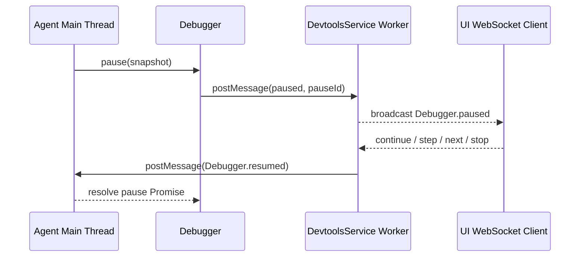

# @vitamin/devtools

面向 vitamin Agent 的最小调试基础设施。

当前实现采用“主线程业务执行 + Worker 控制平面 + 异步暂停恢复”的结构：

- `Debugger.pause()` 在 Agent 线程内返回 Promise。
- `DevtoolsService` 在独立 Worker 线程内维护 WebSocket inspect 服务。
- WebSocket 客户端收到 `Debugger.paused` 事件后发送调试命令，Worker 通过 `Debugger.resumed` 消息恢复执行。

这样可以避免主线程阻塞，同时保持调试控制面与 Agent 执行面解耦。

## 当前目录结构

```text
src/
  devtools.ts
  index.ts
  protocol.ts
  service.ts
  tools/
    debugger.ts
    logger.ts
```

## 核心流程



## 服务端点

- `ws://127.0.0.1:{port}/{serviceId}/inspect` — WebSocket 调试通道

日志与会话透传通过主线程 `postMessage` 到 Worker 后再广播到 WebSocket 客户端，不再依赖 HTTP 命令端点。

## 示例

```ts
import { createDevtools } from '@vitamin/devtools'

const devtools = createDevtools(3000)
await devtools.start()

devtools.debugger.pause({
  turn: 1,
  point: 'model_before',
  frameDepth: 0,
  messagesCount: 3,
})
```

## 当前边界

- 已支持异步暂停恢复、日志广播、基础 WebSocket 控制恢复。
- `pause()` 当前返回 `PauseResult`，可携带 `continue/next/step/over/stop` 与附加 payload。
- `session` 通道仍是透传广播，未形成完整会话调试协议。

## 下一步

1. 把调试命令映射进 `@vitamin/agent` 的中止和单步状态机。
2. 为 `pause()` 增加跨线程端到端测试，覆盖真实异步恢复流程。
3. 为 logger/session/debugger 统一 schema 和版本化协议。

## 主要导出

- `createDevtools` — 创建 `Devtools` 实例（含 debugger + DevtoolsService）
- `DevtoolsService` — 独立 Worker 线程中的 WebSocket inspect 服务
- `Breakpoints` — 断点管理类，支持 `list()`, `get(point)`, `shouldPause(point)`, `set(point, enabled)` 操作
- 类型：`Devtools`, `DebugSnapshot`, `PauseResult`, `DevtoolsOptions`
