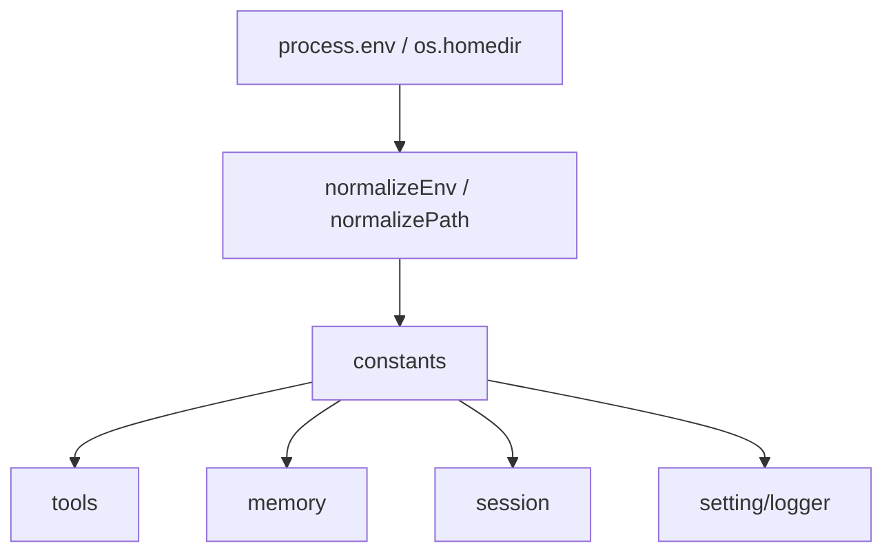

# @x-mars/env 设计说明

## 设计目标

- 集中管理运行环境变量、路径常量与阈值配置。
- 提供统一的环境变量读取与归一化入口，避免各包直接散落地读取 `process.env`。
- 所有常量在模块加载时一次性计算并导出，确保运行期一致性。
- 零运行时依赖，作为整个 monorepo 的配置基底。
- 通过导出常量的方式，确保全局一致的默认值。

## 非目标

- 不做运行时配置热更新。
- 不承担业务逻辑。

## 实现原理

### 环境变量标准化（normalizeEnv）

`normalizeEnv(value, defaultValue)` 将字符串环境变量安全转换为正整数。对 `undefined`、非数字、零值和负值均返回默认值并记录警告日志。

### 路径常量

基于 `process.env` 和 `os.homedir()` 计算 X-Mars 约定路径：

- `X_MARS_HOME`：用户级 X-Mars 主目录（默认 `~/.x-mars`）
- `X_MARS_PROJECT_DIR`：项目级 `.x-mars` 目录
- `SESSION_DIR` / `CHECKPOINT_DIR`：会话和检查点存储目录
- 所有路径经 `normalizePath()` 统一为正斜杠格式。

### 阈值与限制

按域划分导出常量：

- **工具配置**：`TOOLS_MAX_OUTPUT_LINES` / `TOOLS_MAX_OUTPUT_BYTES` / `TOOLS_EXECUTE_TIMEOUT_MS` 等
- **Agent 配置**：`AGENT_TOOLS_MAX_TURNS`
- **内存管理**：`MEMORY_COMPACTION_*` / `MEMORY_PRUNE_*` 系列（触发比例、保护比例、最小 token 数）
- **会话管理**：`SESSION_IDLE_TIMEOUT_MS` / `SESSION_MAX` / `SESSION_PAGE_SIZE`
- **工具名称常量**：`MEMORY_TOOL_WRITE` / `MEMORY_TOOL_READ` / `MEMORY_LEGACY_TOOL_*` 等

### GitHub 认证

导出 `GITHUB_CLIENT_ID`（base64 编码）、`GITHUB_SCOPE`、`GITHUB_COPILOT_USER_AGENT` 等认证相关常量。

## 实现流程

```
@x-mars/env 模块加载
       |
  读取 process.env + os.homedir()
       |
  normalizeEnv() 安全转换
       |
  导出为 const 常量供其他包消费
```

单文件实现（`src/index.ts`），模块加载时一次性计算所有常量。

## 模块分层

| 文件           | 职责                   |
| -------------- | ---------------------- |
| `src/index.ts` | 所有环境常量定义与导出 |

## 入口与依赖

- **入口**：`src/index.ts`
- **内部依赖**：无
- **外部依赖**：无（仅 Node.js 内置模块）

## 测试策略

- 测试文件数：1（`env.test.ts`，覆盖 normalizeEnv 的 6 种边界情况）

## 模块设计基线

### 设计目的

集中定义运行时路径、环境变量、阈值和默认常量，是所有包共享的配置基底。

### 接口设计

- `X_MARS_HOME` / `X_MARS_PROJECT_DIR`：用户级与项目级目录。
- `LOG_FILE` / `LOG_LEVEL`：日志默认配置。
- `TOOLS_*` / `MEMORY_*` / `SESSION_*`：工具、记忆、会话阈值。
- `normalizeEnv()`：安全读取正整数环境变量。

### 方法论

环境常量在模块加载时一次性归一化，避免不同包各自读取 `process.env` 造成语义漂移。

### 实现逻辑

读取 `process.env` 和 Node 内置环境，归一化路径与数值，导出不可变常量供上层包消费。

### 流程逻辑图


