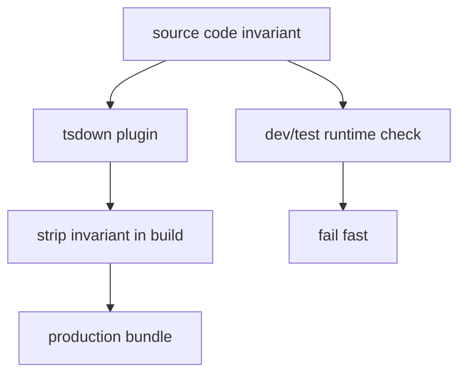

# @x-mars/invariant 设计说明

## 设计目标

- 提供轻量的运行时断言工具，替代 `if (!cond) throw new Error(...)` 模式。
- 提供构建期的 Rollup/tsdown 插件，在生产构建中删除 invariant 调用，减小包体积。
- 作为全局最底层依赖，自身不依赖任何其他 X-Mars 包。
- 支持开发期精确断言 + 生产构建自动剥离，实现零运行时开销。

## 非目标

- 不在本包内实现业务逻辑。
- 不做运行时日志采集（仅条件输出到 console）。

## 实现原理

### 断言函数（invariant.ts）

`invariant(condition, message?)` 提供带 TypeScript `asserts` 子句的运行时断言：

- 条件为 falsy 时抛出 `InvariantError`（携带 `framesToPop = 1` 用于栈清理）。
- 支持布尔值或函数型条件、字符串或数字消息。

命名空间方法 `invariant.debug()` / `.log()` / `.warn()` / `.error()` 根据当前 verbosity 级别条件输出到 console。`setVerbosity(level)` 动态切换级别，返回旧值以便测试恢复。

### 构建期剥离插件（tsup-strip-invariant-plugin.ts）

`createStripInvariantInProductionPlugin(options)` 是 tsup/esbuild 插件，在构建阶段自动移除开发断言代码：

1. 检测 `if (process.env.NODE_ENV !== 'production') { ... }` 守卫块。
2. 扫描块内是否包含 `invariant()` 调用（支持 import alias）。
3. 有 invariant 调用则移除整个 if 块，保留 else 分支。
4. 若 import 语句中 invariant 已无引用，移除该 import。

基于 TypeScript AST 实现精确变换，不依赖正则。

## 实现流程

```
开发时：
  invariant(condition, message) --> 条件检查 --> 失败抛出 InvariantError

生产构建：
  tsup 加载 stripInvariantPlugin
       |
  扫描 process.env.NODE_ENV 守卫块
       |
  检测 invariant() 调用 --> 移除守卫块 + 清理未用 import
       |
  产物中不含断言代码
```

## 模块分层

| 文件                                 | 职责                                                 |
| ------------------------------------ | ---------------------------------------------------- |
| `src/invariant.ts`                   | invariant 断言函数 + InvariantError + verbosity 控制 |
| `src/tsup-strip-invariant-plugin.ts` | 构建期 AST 剥离插件                                  |
| `src/index.ts`                       | barrel 导出                                          |

## 入口与依赖

- **入口**：`src/index.ts`
- **内部依赖**：无
- **外部依赖**：`typescript`（用于 AST 解析）

## 测试策略

- 测试文件数：2
- `invariant.test.ts`：断言行为、错误类型、verbosity 控制
- `tsup-strip-invariant-plugin.test.ts`：9 种 AST 变换场景

## 模块设计基线

### 设计目的

提供开发期断言和构建期剥离能力，使运行时代码可保留强约束而不增加生产包负担。

### 接口设计

- `invariant(condition, message)`：运行时断言。
- `assertNever(value)`：穷尽性检查。
- `tsdown-strip-invariant-plugin`：构建时剥离断言代码。

### 方法论

在边界处显式断言，在构建链路中消除可证明的开发辅助代码，兼顾开发安全和产物体积。

### 实现逻辑

源码调用 invariant 表达设计前置条件；测试覆盖错误路径；构建插件在产物阶段按规则移除或压缩断言。

### 流程逻辑图


