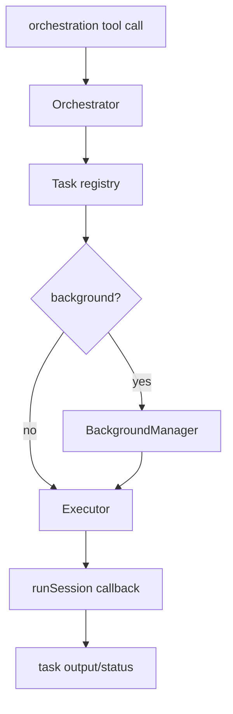

# @x-mars/orchestrator 设计说明

## 设计目标

- 管理多 Agent 任务的创建、调度、重试与生命周期。
- 提供 TaskStore（任务存储）+ TaskExecutor（任务执行器）+ CircuitBreaker（熔断器）组合。
- 支持同步/后台混合任务调度。

## 非目标

- 不实现 Agent 本身（由 `@x-mars/agent` 完成）。
- 不管理 Agent 间协作拓扑（由 `@x-mars/swarm` 完成）。

## 实现原理

### TaskStore（task-store.ts）

基于内存 Map 的任务 CRUD 存储：

- `create(task)` / `get(id)` / `update(id, patch)` / `delete(id)` / `list(filter?)`
- 任务状态：`pending` → `running` → `completed` / `failed` / `cancelled`
- 支持 `result` / `error` / `retryCount` / `createdAt` / `updatedAt` 跟踪

### TaskExecutor（task-executor.ts）

任务执行引擎：

- `dispatch(task)`：根据任务类型选择同步或后台执行
- `maxActiveTasks`：并发限制
- **同步执行**：直接等待 Agent 执行结果
- **后台执行**：交给 BackgroundManager 异步处理
- 自动重试：失败时按 RetryPolicy 决定是否重试

### RetryPolicy（retry-policy.ts）

- `shouldRetry(error, retryCount)`：基于错误类型和重试次数判断
- `getDelay(retryCount)`：指数退避 + 随机抖动
- `maxRetries`：最大重试次数

### CircuitBreaker（circuit-breaker.ts）

断路器模式，防止级联失败：

- **CLOSED**：正常状态，失败计数
- **OPEN**：连续失败超阈值，拒绝所有请求
- **HALF_OPEN**：超时后尝试单次请求，成功→CLOSED，失败→OPEN
- `consecutiveFailureThreshold`：触发阈值
- `resetTimeoutMs`：OPEN 到 HALF_OPEN 的超时

### Orchestrator（orchestrator.ts）

顶层协调器，暴露业务友好的 API：

- `dispatchTask(options)` → 创建任务 + dispatch（支持 `onCreated` / `onStarted` / `onCompleted` / `onFailed` / `onCancelled` 回调）
- `callAgent(profile, message)` → 委托给指定 Agent Profile 执行单次任务
- `createTask(options)` → 仅创建任务（不立即执行，延迟 dispatch）
- `writeTodos(todos)` → 批量创建/更新任务列表（对应 `write_todos` 工具）
- `clarifyRequest(question)` → 向用户提问并等待确认
- 所有操作发射 Hook 事件（`task.created` / `task.started` / `task.completed` 等）

**RetryPolicy.fromWorkflowOptions(options)**：从 `WorkflowOptions` 配置对象创建 `RetryPolicy`，支持从 setting 层面定义全局重试策略。

### BackgroundManager（background-manager.ts）

管理后台异步任务：

- `submit(task, executor)` → 异步执行 + 状态更新
- `cancel(taskId)` → 中止任务
- `getStatus(taskId)` → 查询状态
- 内部维护运行中任务的 Map + AbortController

## 实现流程

```
调用方 --> Orchestrator.dispatchTask(options)
               |
          TaskStore.create(task)
               |
          CircuitBreaker.guard() --> OPEN? → 拒绝
               |
          TaskExecutor.dispatch(task)
             /          \
        同步执行      后台执行
            |           |
        Agent.run()   BackgroundManager.submit()
            |           |
        结果/错误      异步结果/错误
            |           |
        TaskStore.update(status)
            |
        失败? → RetryPolicy.shouldRetry()
            |
        是 → 计算 delay → 重新 dispatch
        否 → CircuitBreaker.recordFailure()
```

## 模块分层

| 文件                        | 职责                                        |
| --------------------------- | ------------------------------------------- |
| `src/types.ts`              | Task / TaskStatus / OrchestratorConfig 类型 |
| `src/task-store.ts`         | 任务存储 CRUD                               |
| `src/task-executor.ts`      | 任务执行引擎                                |
| `src/retry-policy.ts`       | 指数退避重试策略                            |
| `src/circuit-breaker.ts`    | 断路器（CLOSED/OPEN/HALF_OPEN）             |
| `src/orchestrator.ts`       | 顶层协调器                                  |
| `src/background-manager.ts` | 后台任务管理                                |
| `src/index.ts`              | barrel 导出                                 |

## 入口与依赖

- **入口**：`src/index.ts`
- **内部依赖**：`@x-mars/agent`、`@x-mars/shared`、`@x-mars/env`、`@x-mars/invariant`
- **外部依赖**：无

## 测试策略

- 测试文件数：6
- 覆盖：TaskStore CRUD、执行器调度、重试策略、断路器状态机、后台管理器、协调器编排

## 模块设计基线

### 设计目的

提供多任务、后台任务、子代理调用和任务状态管理的编排能力，是 Agent 工具调用与多会话执行之间的调度层。

### 接口设计

- `Orchestrator`：任务创建、派发、查询、取消和输出读取。
- `createTask` / `task_delegate` / `agent_call` 等工具回调类型。
- `BackgroundManager`：后台任务生命周期。
- `Executor`：封装 runSession 回调执行。

### 方法论

编排器不直接执行模型，只调度 session runtime；任务状态必须可查询、可取消、可追踪输出。

### 实现逻辑

工具创建任务后，orchestrator 根据执行模式同步或后台调用 runSession，持续记录状态、输出和错误，供用户或主 Agent 查询。

### 流程逻辑图


