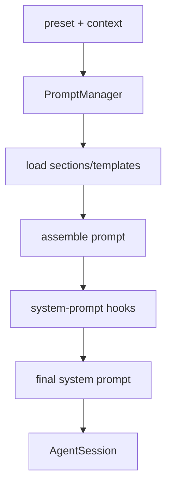

# @x-mars/prompt 设计说明

## 设计目标

- 管理系统提示模板的加载、缓存与组装。
- 支持本地文件系统（`prompts/` 目录）和 HTTP 两种提示源，源可插拔切换。
- 提供主 Agent 和子 Agent 两种不同粒度的提示组装策略。
- 将 Agent Profile（角色模板）与运行时上下文（任务/文件）解耦，通过占位符替换注入上下文。
- 提供 lesson（经验教训）和 phase（阶段标记）的注入/提取工具，辅助 Agent 生命周期感知。

## 非目标

- 不负责提示的执行（由 `@x-mars/agent` 完成）。
- 不管理模型选择（由 `@x-mars/ai` 完成）。
- 不做实时上下文收集（git 状态等由调用方注入）。

## 实现原理

### 提示提供者（PromptProvider 接口）

两种实现：

**LocalPromptProvider**（local-provider.ts）：

- 读取指定目录（`baseDir`）下的 `.md` 文件，文件路径相对 baseDir 作为 key（如 `lesson/session-end-learning`）。
- `load(key)` → 读文件 + 获取 mtime 作为版本号。
- `list()` → 递归遍历目录，收集所有 key。

**HttpPromptProvider**（http-provider.ts）：

- 通过 HTTP GET `{baseUrl}/{key}` 加载远程模板。
- 支持认证头注入。

### PromptCache（prompt-cache.ts）

简单 KV 缓存，存储 `{ content, version }` 对。`has(key)` 检查缓存命中；`set(key, content, version)` 存入；`get(key)` 取值；`invalidate(key)` 删除。版本号（mtime 或 ETag）用于增量更新判断。

### PromptManager（prompt-manager.ts）

协调 Provider 和 Cache 的主入口：

- `load(key)` → Provider 加载 → 写入 Cache → 返回内容。
- `assemble()` → 加载 `lead-guidance` key，返回主提示（缓存命中则直接返回）。
- `assemblePreset(options)` → 按预设类型（`main` / `subagent`）分支：
  - `main`：调用 `assemble()` 加载基础提示。
  - `subagent`：若有 `profile` 则调用 `assembleSubAgentPrompt(profile, context)`，否则调用 `assembleGenericSubAgentPrompt(agentName, context)` 生成通用子 Agent 提示。
- `loadSessionEndLearningPrompt()` / `loadRuntimeLessonsTemplate()`：加载特定 lesson 模板。

### SubAgent 提示组装（sub-agent-prompt.ts）

- `assembleSubAgentPrompt(profile, context)`：将 `AgentProfile.systemPromptTemplate` 中的占位符（`{task_title}` / `{task_description}` / `{task_files}`）替换为实际值。
- `assembleGenericSubAgentPrompt(agentName, context)`：不依赖 Profile，生成最小可用的子 Agent 提示。

### Agent Profile（types.ts）

```typescript
interface AgentProfile {
  name: string
  taskTypes: string[] // 擅长的任务类型列表
  capabilities: string[] // 能力描述
  systemPromptTemplate: string // 含占位符的模板字符串
  defaultTools?: string[] // 该 profile 默认启用的工具
  preferredModelTier?: string // fast / standard / powerful
  defaultMaxToolTurns?: number // 最大工具调用轮数
}
```

BUILTIN_AGENT_PROFILES（`@x-mars/setting`）定义内置的 `coding`、`review`、`test` 等角色。用户可通过 `x-mars.json` 的 `agents` 字段追加自定义 profile。

### 环境上下文（environment-context.ts）

收集并格式化运行时信息作为提示上下文的一部分：

- 操作系统类型/版本、shell 类型、工作目录、用户名
- 当前时间（UTC ISO 格式）

### Phase 上下文（phase-context.ts）

在提示中插入和提取阶段标记，用于 coding session 的阶段追踪（规划/实现/验证等）：

- `buildPhaseContext(phase, options)` → 格式化阶段说明字符串。

### Lesson 注入（lesson-injection.ts）

将经验教训列表注入到 system prompt 的合适位置：

- 提取 lessons 为 Markdown 格式，追加到主提示尾部。

## 调用链路

### 主 Agent 提示组装

```
AgentSession.run()
       |
  PromptManager.assemblePreset({ preset: 'main' })
       |
  1. provider.load('lead-guidance')
       |
       ├── LocalPromptProvider → readFile(baseDir/lead-guidance.md)
       └── HttpPromptProvider → GET baseUrl/lead-guidance
       |
  2. cache.set('lead-guidance', content, version)
       |
  返回 systemPrompt（提示内容）

AgentSession 同时注入 environment-context（由 hooks 层完成）
```

### 子 Agent 提示组装

```
Orchestrator.dispatchTask(agentName, prompt)
       |
  PromptManager.assemblePreset({ preset: 'subagent', agentName, profile, context })
       |
  resolveAgentProfile(agentName)  ← 从 BUILTIN_AGENT_PROFILES 或用户配置查找
       |
  profile 存在?
    是 → assembleSubAgentPrompt(profile, context)  ← 替换 {task_*} 占位符
    否 → assembleGenericSubAgentPrompt(agentName, context)
       |
  返回 subAgentSystemPrompt
```

## 模块分层

| 文件                         | 职责                                                 |
| ---------------------------- | ---------------------------------------------------- |
| `src/types.ts`               | PromptProvider / PromptEntry / AgentProfile 核心类型 |
| `src/prompt-manager.ts`      | 提示加载、缓存与组装协调器                           |
| `src/prompt-cache.ts`        | KV 缓存（key → content + version）                   |
| `src/local-provider.ts`      | 本地文件系统提示源                                   |
| `src/http-provider.ts`       | HTTP 远程提示源                                      |
| `src/prompt-factory.ts`      | PromptProvider 工厂（按配置创建对应实现）            |
| `src/sub-agent-prompt.ts`    | AgentProfile 模板组装 + 泛用子 Agent 提示            |
| `src/environment-context.ts` | 运行时环境信息收集与格式化                           |
| `src/phase-context.ts`       | Phase 标记构建                                       |
| `src/lesson-injection.ts`    | 经验教训 Markdown 格式化与注入                       |
| `src/constants.ts`           | BUILTIN_PROMPTS_DIR 等路径常量                       |
| `src/index.ts`               | barrel 导出                                          |
| `prompts/`                   | 内置 Markdown 提示模板文件集合                       |

## 入口与依赖

- **入口**：`src/index.ts`
- **内部依赖**：`@x-mars/setting`、`@x-mars/shared`、`@x-mars/env`
- **外部依赖**：无

## 测试策略

- 测试文件数：6
- 覆盖：PromptManager 组装逻辑、LocalProvider 文件遍历、SubAgent 占位符替换、环境上下文格式化、Phase 上下文构建、PromptCache 读写。

## 非目标

- 不负责提示的执行（由 `@x-mars/agent` 完成）。
- 不管理模型选择（由 `@x-mars/ai` 完成）。

## 实现原理

### PromptManager（prompt-manager.ts）

提示管理的核心协调器：

- `getSystemPrompt(profile, context)` → 组装完整系统提示
- `getSubAgentPrompt(profile, task)` → 子 Agent 特化提示
- `resolve(name)` → 按名称解析模板
- 内置缓存层（PromptCache），支持 TTL 和手动失效

### 提示提供者

- `LocalPromptProvider`：从文件系统读取 prompt 模板（`.x-mars/prompts/` 或内置 `prompts/` 目录）
- `HttpPromptProvider`：从 HTTP 端点加载远程模板

### 系统提示组装流程

系统提示由多段内容拼接：

1. **基础模板**：Agent Profile 对应的角色描述和行为指引
2. **环境上下文**：workspace 目录、git 分支/状态、操作系统信息
3. **记忆注入**：AGENTS.md 内容、经验教训
4. **技能提示**：匹配的 SKILL.md 指令
5. **工具列表**：当前可用工具的描述
6. **自定义指令**：用户配置的额外指令

### Agent Profile 解析（profile-resolver.ts）

- `resolveProfile(name)`：精确名称匹配
- `fuzzyResolveProfile(query)`：模糊匹配（支持别名、关键词）
- 从 `@x-mars/setting` 的 BUILTIN_AGENT_PROFILES 和用户自定义 agents 中解析

### 环境上下文收集（environment-context.ts）

收集运行时环境信息：

- `getWorkspaceContext()`：当前目录、项目名称
- `getGitContext()`：分支、最近提交、文件状态
- `getSystemContext()`：OS、Node 版本
- 格式化为模板变量供提示插入

### Phase 上下文（phase-context.ts）

支持在提示中注入/提取阶段标记：

- `injectPhaseContext(prompt, phase)` → 插入 `[PHASE:xxx]` 标记
- `extractPhaseContext(prompt)` → 提取阶段信息

### Lesson 注入（lesson-injector.ts）

将经验教训格式化注入提示：

- `formatLessons(lessons)` → Markdown 列表
- `injectLessons(prompt, lessons)` → 在指定位置插入

## 实现流程

```
AgentSession.chat()
       |
  PromptManager.getSystemPrompt(profile, context)
       |
  1. resolveProfile(profile) → 基础模板
  2. getEnvironmentContext() → 环境变量
  3. context.memories → 记忆内容
  4. context.skills → 技能指令
  5. context.tools → 工具描述
  6. injectLessons() → 经验教训
       |
  模板占位符替换 → 完整系统提示
       |
  返回 systemPrompt string

子 Agent 提示组装：
  PromptManager.getSubAgentPrompt(profile, task)
       |
  基础模板 + 任务描述 + 作用域限制
       |
  返回 subAgentSystemPrompt
```

## 模块分层

| 文件                           | 职责                                                |
| ------------------------------ | --------------------------------------------------- |
| `src/types.ts`                 | PromptTemplate / PromptContext / ProfileConfig 类型 |
| `src/prompt-manager.ts`        | 提示管理与组装协调                                  |
| `src/prompt-cache.ts`          | 模板缓存（TTL）                                     |
| `src/local-prompt-provider.ts` | 文件系统提示源                                      |
| `src/http-prompt-provider.ts`  | HTTP 提示源                                         |
| `src/profile-resolver.ts`      | Agent Profile 精确/模糊解析                         |
| `src/environment-context.ts`   | 环境上下文收集                                      |
| `src/phase-context.ts`         | Phase 标记注入/提取                                 |
| `src/lesson-injector.ts`       | 经验教训注入                                        |
| `src/index.ts`                 | barrel 导出                                         |
| `prompts/`                     | 内置提示模板文件                                    |

## 入口与依赖

- **入口**：`src/index.ts`
- **内部依赖**：`@x-mars/setting`、`@x-mars/shared`、`@x-mars/env`、`@x-mars/invariant`
- **外部依赖**：无

## 测试策略

- 测试文件数：6
- 覆盖：提示组装、模板解析、Profile 解析、环境上下文、缓存失效、Lesson 注入

## 模块设计基线

### 设计目的

管理系统提示、子代理提示、模板片段和提示组装策略，为 Agent 提供可组合的 prompt 产物。

### 接口设计

- `PromptManager`：加载、注册、组装 prompt section。
- `assemblePreset()`：按 preset 生成系统提示。
- `subAgentPrompt`：子代理提示构建。
- `prompts/*.md`：内置提示词资产。

### 方法论

Prompt 作为运行时产物按需组装，section 可由 Hook 改写，避免把提示词硬编码在 Agent 循环内。

### 实现逻辑

创建 session 时确定 preset；执行前加载模板和上下文 section，经 Hook transform 后输出最终 system prompt。

### 流程逻辑图


