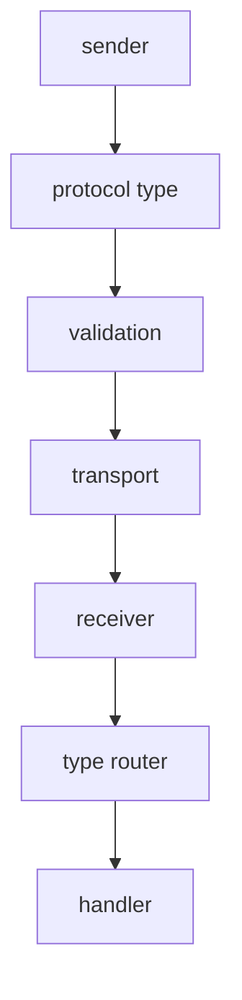

# @x-mars/protocol 设计说明

## 模块设计基线

### 设计目的

定义跨进程、WebSocket、服务端和前端共享的协议类型与校验逻辑，保证消息边界稳定。

### 接口设计

- `src/types.ts`：共享消息、事件和 DTO 类型。
- `src/validation.ts`：协议消息校验。
- `package exports`：对 service、opendev-ui、tests 暴露协议入口。

### 方法论

协议包只承载传输契约，不依赖具体 UI 或 runtime；新增消息必须先定义类型与校验，再接入发送方和消费方。

### 实现逻辑

发送方构造协议消息，validation 进行结构校验，传输层发送，接收方按 type 分发到业务处理器。

### 流程逻辑图

