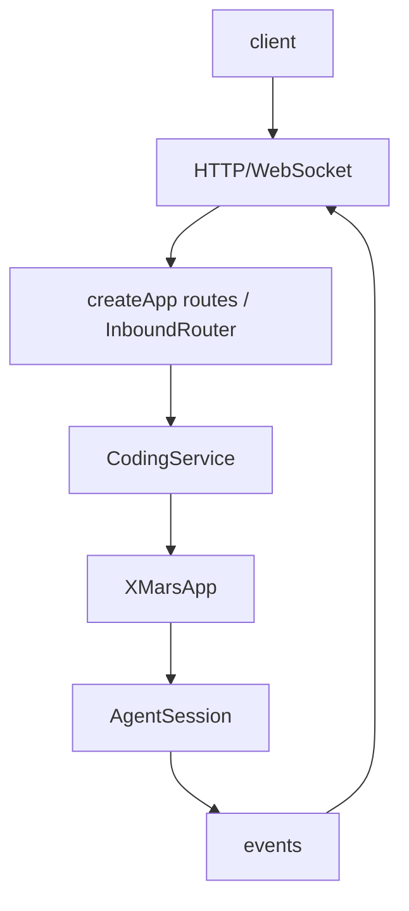

# @x-mars/service 设计说明

## 设计目标

- 提供 X-Mars 的网络传输层：HTTP API + WebSocket 实时通信。
- 基于 Hono 框架实现轻量级 RESTful 路由。
- 通过 EventBridge 将 AgentSession 事件映射到 WebSocket 协议。

## 非目标

- 不实现业务逻辑（由 `@x-mars/coding` 提供 XMarsApp 和 AgentSession）。
- 不负责前端渲染（由 `@x-mars/web-ui` 完成）。

## 实现原理

### CodingService（coding-service.ts）

核心服务类，组合 HTTP(Hono) + WebSocket(ws) + EventBridge + DebugBridge + InboundRouter：

#### HTTP 路由（create-app.ts）

| 路由            | 方法                 | 功能                                |
| --------------- | -------------------- | ----------------------------------- |
| `/health`       | GET                  | 健康检查                            |
| `/chat`         | POST                 | 发送消息（流式 SSE 响应）           |
| `/sessions`     | GET / POST           | 会话列表 / 创建会话                 |
| `/sessions/:id` | GET / PATCH / DELETE | 单会话查询 / 更新 / 删除            |
| `/setting`      | GET / PUT            | 配置读写                            |
| `/devtools`     | GET / POST           | 调试操作（断点 / 快照 / 步进）      |
| `/logs`         | GET                  | 日志查询（支持 level / since 过滤） |
| `/workspace`    | GET                  | 工作区信息（路径 / 文件树预览）     |

所有路由在 `create-app.ts` 的 `createApp(service)` 函数中统一注册，返回 Hono 应用实例。

`start()` 方法延迟注册所有事件监听器（避免过早订阅）：

```typescript
service.start()
  → 注册 WebSocketManager 监听器
  → 注册 EventBridge 到各 AgentSession
  → 注册 DebugBridge 到 DevTools
  → HTTP 服务器开始监听端口
```

### InboundRouter（inbound-router.ts）

处理来自 WebSocket 客户端的入站消息路由：

- 接收 `{ type, sessionId, payload }` 格式的 JSON 消息
- 路由到对应 Handler：`chat` / `abort` / `subscribe` / `unsubscribe` / `breakpoint` / `debug_step`
- 反馈操作结果到发起客户端

### WebSocketManager（websocket-manager.ts）

管理 WebSocket 客户端连接：

- `handleConnection(ws)` → 注册客户端
- `subscribe(clientId, sessionId)` → 绑定客户端到会话
- `broadcast(sessionId, event)` → 向订阅会话的所有客户端广播
- `disconnect(clientId)` → 清理连接

### EventBridge（event-bridge.ts）

AgentSession 事件到 WebSocket 协议的单向映射（40+ 事件类型）：

- Agent 事件：`status_change` / `stream_event` / `tool_call_start` / `tool_call_end` / `messages_updated`
- Session 事件：`session:created` / `session:deleted`
- 系统事件：`error` / `abort`

每个事件映射为 JSON 消息结构：`{ type, sessionId, data, timestamp }`

### DebugBridge（debug-bridge.ts）

将 `@x-mars/devtools` 的调试协议桥接到 HTTP/WebSocket：

- `/api/debug/breakpoints` → 断点管理
- `/api/debug/snapshot` → 调试快照
- WebSocket debug 事件转发

## 实现流程

```
客户端 --> HTTP 请求 --> Hono 路由 --> 业务处理 --> JSON 响应
                                        |
                                   XMarsApp 方法调用
                                        |
客户端 --> WebSocket 连接 --> WebSocketManager
                                |
                          subscribe(session)
                                |
                          AgentSession 事件
                                |
                          EventBridge.map(event)
                                |
                          broadcast 到订阅客户端

聊天流程：
  POST /api/chat { sessionId, message }
       |
  app.getSession(sessionId).chat(message)
       |
  SSE 流式响应：
    event: stream_start
    event: stream_chunk { text }
    event: tool_call { name, args }
    event: stream_end { message }
```

## 模块分层

| 文件                       | 职责                                  |
| -------------------------- | ------------------------------------- |
| `src/types.ts`             | ServiceConfig / WebSocketMessage 类型 |
| `src/coding-service.ts`    | Hono HTTP 路由 + 启动                 |
| `src/websocket-manager.ts` | WebSocket 连接管理                    |
| `src/event-bridge.ts`      | 事件 → WebSocket 映射                 |
| `src/debug-bridge.ts`      | 调试协议桥接                          |
| `src/index.ts`             | barrel 导出                           |

## 入口与依赖

- **入口**：`src/index.ts`
- **内部依赖**：`@x-mars/coding`、`@x-mars/devtools`、`@x-mars/shared`、`@x-mars/env`
- **外部依赖**：`hono`、`@hono/node-server`

## 测试策略

- 测试文件位于 `example/` 目录，以集成示例形式验证

## 模块设计基线

### 设计目的

提供 HTTP/WebSocket 服务层，把浏览器、RPC 或外部客户端请求桥接到 XMarsApp 和 AgentSession。

### 接口设计

- `createApp()`：创建服务应用。
- `CodingService`：持有 XMarsContext、会话和事件桥。
- `InboundRouter`：处理入站协议消息。
- `routes/*`：health、sessions、setting、workspace、devtools 等 HTTP 路由。

### 方法论

Service 只处理传输、序列化和事件桥接，不把 Agent 执行细节泄漏给前端；所有入站消息先校验再路由。

### 实现逻辑

客户端连接后发送请求或订阅事件；service 校验消息，调用 session/runtime，序列化事件并通过 WebSocket 或 HTTP 返回。

### 流程逻辑图


