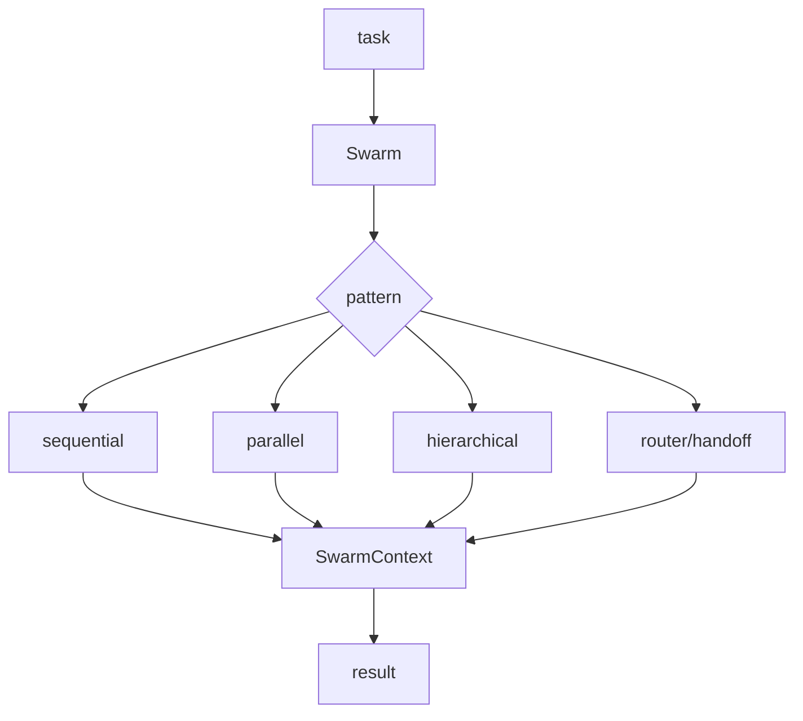

# @x-mars/swarm 设计说明

## 设计目标

- 提供多 Agent 协作的编排模式：handoff / sequential / parallel / hierarchical / router。
- 支持灵活的路由策略：LLM / 规则 / 轮询 / 随机 / 自定义。
- 通过 SwarmContext 实现跨 Agent 共享状态。

## 非目标

- 不实现单 Agent 执行循环（由 `@x-mars/agent` 完成）。
- 不管理具体工具（由 `@x-mars/tools` 完成）。

## 实现原理

### 协作模式

#### Handoff（handoff.ts）

Agent 间直接转交控制权：

- Agent A 在工具调用中发起 handoff → Agent B 接管
- 支持上下文传递（消息历史、工具状态）
- 验证转交目标合法性
- 深度限制防止无限转交

#### Sequential（sequential.ts）

管道式串行协作：

- Agent 列表按序执行
- 上一个 Agent 输出作为下一个的输入
- 任一环节失败则中止管道
- 支持条件跳过

#### Parallel（parallel.ts）

并发协作：

- 多个 Agent 同时执行相同或不同任务
- `maxConcurrency` 控制并行度
- 结果聚合策略（全部完成 / 任一完成 / 多数投票）

#### Hierarchical（hierarchical.ts）

监督者-工人层级协作：

- Supervisor Agent 分析任务并分配给 Worker Agent
- Worker 执行后向 Supervisor 汇报
- Supervisor 可重新分配或调整策略
- 支持多级嵌套

#### Router（router.ts）

动态任务路由：

- 根据策略选择最合适的 Agent
- 路由策略可插拔

### SwarmRouter（swarm-router.ts）

路由策略管理：

- `llm`：使用 LLM 分析任务并选择 Agent
- `rule`：基于预定义规则（正则/关键词）匹配
- `round-robin`：轮询分发
- `random`：随机选择
- `custom`：自定义回调策略

### SwarmContext（swarm-context.ts）

跨 Agent 共享状态容器：

- `get(key)` / `set(key, value)` / `has(key)` / `delete(key)`
- 内置并发安全机制
- 支持命名空间隔离

### SwarmAgentDef（types.ts）

`SwarmAgentDef` 是纯声明式的 Agent 定义，不包含任何运行时状态：

```typescript
interface SwarmAgentDef {
  id: string
  profile: string // Agent Profile ID（来自 @x-mars/setting 预设）
  capabilities?: string[] // 能力标签（路由匹配用）
  instructions?: string // 附加指令（追加到系统提示）
  maxRounds?: number // 最大执行轮次
  handoffTargets?: string[] // 允许 handoff 的目标 ID
}
```

**运行时分离**：`SwarmAgentDef` 仅描述行为规范，实际执行由 `createRunContext(def, context)` 工厂函数创建 `AgentRunContext`，再由 `@x-mars/agent` 的 Agent 实例执行。这种分离使 Swarm 在测试时可注入 mock 执行器。

## 实现流程

```
调用方 --> Swarm.run(config, task)
              |
         根据 mode 选择模式

Handoff:
  Agent A 执行 → handoff_tool 调用 → 验证 → Agent B 接管 → ...

Sequential:
  [A → B → C] 按序执行，输出传递

Parallel:
  [A, B, C] 并发执行 → 结果聚合

Hierarchical:
  Supervisor 分析 → 分配给 Worker → 汇报 → Supervisor 决策

Router:
  SwarmRouter.route(task)
       |
  策略评估（llm / rule / round-robin / random / custom）
       |
  选中 Agent 执行
```

## 模块分层

| 文件                   | 职责                                          |
| ---------------------- | --------------------------------------------- |
| `src/types.ts`         | SwarmConfig / SwarmMode / RouterStrategy 类型 |
| `src/swarm.ts`         | Swarm 入口 + 模式分发                         |
| `src/handoff.ts`       | Handoff 直接转交                              |
| `src/sequential.ts`    | 管道串行                                      |
| `src/parallel.ts`      | 并发执行                                      |
| `src/hierarchical.ts`  | 层级监督                                      |
| `src/router.ts`        | 动态路由                                      |
| `src/swarm-router.ts`  | 路由策略管理                                  |
| `src/swarm-context.ts` | 共享状态容器                                  |
| `src/index.ts`         | barrel 导出                                   |

## 入口与依赖

- **入口**：`src/index.ts`
- **内部依赖**：`@x-mars/agent`、`@x-mars/ai`、`@x-mars/shared`、`@x-mars/invariant`
- **外部依赖**：无

## 测试策略

- 测试文件覆盖各协作模式和路由策略

## 模块设计基线

### 设计目的

提供多 Agent 协作、路由、handoff、并行、串行和层级模式，用于比单 Agent 更复杂的任务分解。

### 接口设计

- `Swarm` / `createSwarm()`：创建和运行协作网络。
- `SwarmRouter` / `createRouter()`：选择目标 Agent。
- `createHandoffTool()` / `validateHandoff()`：Agent 间交接。
- `createSwarmContext()`：共享状态和调用图。

### 方法论

单 Agent 保持独立，Swarm 只做协作结构和上下文传递；路由策略可插拔，handoff 必须受深度和目标校验约束。

### 实现逻辑

用户任务进入 swarm 后按模式选择 Agent；执行结果写入共享上下文；必要时 handoff 或聚合多个 Agent 输出。

### 流程逻辑图


