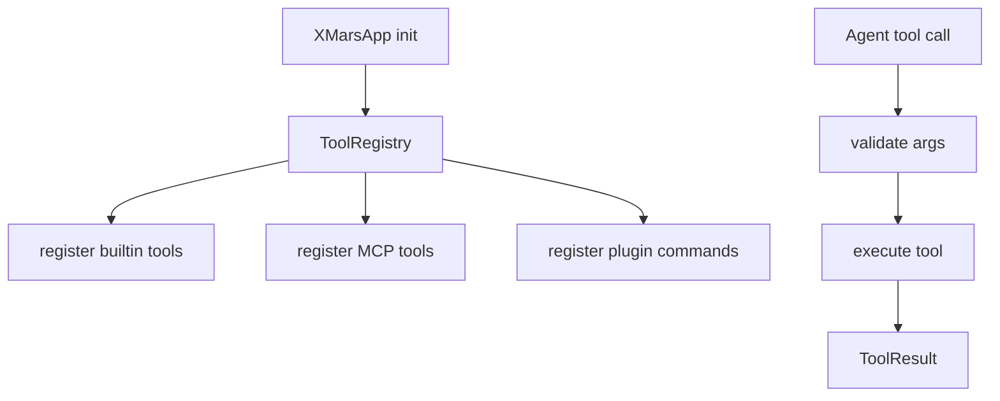

# @x-mars/tools 设计说明

## 设计目标

- 提供 Agent 可用工具的注册、分组与发现能力。
- 内置工具覆盖文件系统、搜索、Shell、Web、编排、会话、技能等域。
- 支持预设分层（minimal / standard / full），按场景裁剪工具集。

## 非目标

- 不负责工具执行管线（由 `@x-mars/agent` ToolExecutor 完成）。
- 不做权限判定（由 `@x-mars/hooks` PermissionGuardHook 完成）。

## 实现原理

### AgentTool 结构

每个工具实现 `AgentTool` 接口：

```typescript
interface AgentTool {
  name: string                             // 唯一工具名（LLM 调用时使用）
  description: string                      // 工具说明（注入到 tools list）
  schema: z.ZodObject<...>                 // 参数 Schema（用于 LLM 和校验）
  preset?: ToolPreset                      // 'minimal' | 'standard' | 'full'
  tags?: string[]                          // 标签（如 'readonly' / 'fs' / 'search'）
  isReadOnly?: boolean                     // 只读标志（影响并行执行策略）
  execute(context: ToolCallContext): Promise<ToolResult>
}
```

### 工具注册表（tool-registry.ts）

`ToolRegistry` 内部使用 `Map<string, ToolEntry>` 存储注册工具：

```typescript
interface ToolEntry {
  tool: AgentTool
  enabled: boolean
  locked: boolean // locked=true 时 disable() 无效（内核工具保护）
  preset: ToolPreset
}
```

- `register(tool, options?)` → 校验 AgentTool 结构（isAgentTool 类型守卫），写入 Map
- `get(name)` / `has(name)` → 单工具查询
- `getEnabled(preset?)` → 返回当前已启用工具（可按 preset 过滤）
- `getByTag(tag)` → 按标签过滤
- `enable(name)` / `disable(name)` → 动态开关
- `lock(name)` / `unlock(name)` → 保护关键工具不被 setting 关闭
- `setPreset(preset)` → 按预设批量切换：`minimal` 只启用只读工具，`standard` 启用标准集，`full` 全开

**预设层级**：

| 预设       | 典型工具                                                  |
| ---------- | --------------------------------------------------------- |
| `minimal`  | read_file / list_dir / grep / find_file / web_fetch       |
| `standard` | + write_file / edit_file / multi_edit / bash / web_search |
| `full`     | + task_delegate / agent_call / load_skill                 |

### 内置工具分类

#### 文件系统（fs/）

- `read_file`：读取文件内容（支持行范围 + 二进制偏移）
- `write_file`：写入新文件，自动创建目录
- `edit_file`：基于精确 oldString/newString 的单点替换
- `multi_edit`：批量多文件替换

#### 搜索（search/）

- `list_dir`：列目录内容
- `find_file`：glob/regex 文件查找
- `grep`：文本/正则搜索
- `semantic_search`：语义搜索

#### Shell（shell/）

- `bash`：Shell 命令执行，支持超时/工作目录/AbortSignal

#### Web（web/）

- `web_search`：网络搜索
- `web_fetch`：获取网页正文

#### 编排（orchestration/）

- `task_delegate`：委托给子 Agent
- `write_todos`：任务列表管理
- `agent_call`：调用指定 Agent 配置
- `review_call`：代码审查委托
- `plan_call`：计划制定委托
- `ask_user`：向用户提问
- `plan_approval`：计划审批请求
- `approval`：操作审批请求
- `abort_task`：中止当前任务

#### 会话（session/）

- `session_summary`：获取会话摘要
- `session_history`：获取历史回合

#### 技能（skill/）

- `load_skill`：加载 SKILL.md 技能文件

### 二进制执行器（binary-executor-registry.ts）

管理第三方二进制工具（ripgrep / find 等）的下载、缓存与按平台执行。`BinaryExecutorRegistry` 支持自动下载和版本管理。

## 实现流程

```
XMarsApp 初始化
       |
  createToolRegistry() --> ToolRegistry
       |
  registerBuiltinTools(registry) --> 30+ 工具注册
       |
  registry.setPreset(preset) --> 按预设启用/禁用
       |
  Agent 运行时 --> ToolExecutor.resolve(toolName)
       |
  registry.get(name) --> AgentTool 实例
       |
  tool.execute(context) --> ToolResult
```

## 模块分层

| 目录/文件                          | 职责                                          |
| ---------------------------------- | --------------------------------------------- |
| `src/types.ts`                     | AgentTool / ToolResult / ToolCallContext 类型 |
| `src/tool-registry.ts`             | 工具注册表 + 预设管理                         |
| `src/binary-executor-registry.ts`  | 二进制工具管理                                |
| `src/builtin-tools/fs/`            | 4 个文件系统工具                              |
| `src/builtin-tools/search/`        | 4 个搜索工具                                  |
| `src/builtin-tools/shell/`         | 1 个 Shell 工具                               |
| `src/builtin-tools/web/`           | 2 个 Web 工具                                 |
| `src/builtin-tools/orchestration/` | 9 个编排工具                                  |
| `src/builtin-tools/session/`       | 2 个会话工具                                  |
| `src/builtin-tools/skill/`         | 1 个技能工具                                  |

## 入口与依赖

- **入口**：`src/index.ts`
- **内部依赖**：`@x-mars/agent`（类型）、`@x-mars/shared`、`@x-mars/env`、`@x-mars/invariant`
- **外部依赖**：`zod`

## 测试策略

- 测试文件数：8
- 覆盖：工具注册、预设切换、各类别内置工具行为、二进制执行器

## 模块设计基线

### 设计目的

提供 Agent 可调用工具、工具注册表、内置工具、MCP 工具、插件命令和 Claude Code 兼容导入能力。

### 接口设计

- `ToolRegistry` / `registerBuiltinTools()`：工具注册和预设开关。
- `AgentTool`：工具名称、schema、只读标记和 execute 入口。
- `PluginManager` / `PluginCommandRegistry`：插件加载和命令注册。
- `create*` 工厂：文件、搜索、shell、web、orchestration、skill 等工具。

### 方法论

工具只描述能力和参数契约，不自行绕过权限；读工具可并行，写工具交由 Agent 和 Hook 管线串行治理。

### 实现逻辑

启动时注册内置工具和插件/MCP 工具；Agent 根据 registry 获取可用工具；工具执行时校验参数、调用实现并返回标准 `ToolResult`。

### 流程逻辑图


